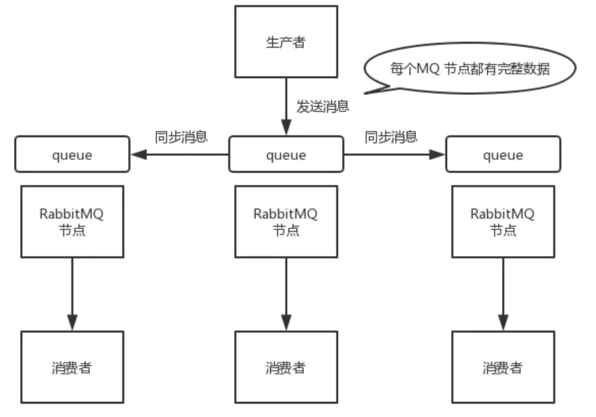
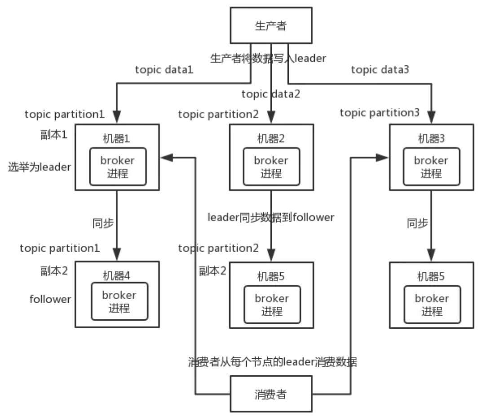

# kafka基础

## 消息队列(Message Queue，简称MQ)

### 为什么需要消息队列

* 解藕
* 冗余
* 扩展性
* 灵活性 & 峰值处理能力
* 可恢复性
* 顺序保证
* 缓冲
* 异步通信

### MQ的应用场景

消息队列的主要应用场景：`解藕`,`异步`,`削峰`，实现高性能、高可用、可伸缩和最终一致性架构，是大型分布式系统不可缺少的中间件；

* 应用耦合：多应用间通过消息队列对关心的消息进行处理，避免调用接口失败导致整个过程失败；
* 异步处理：多应用对消息队列中同一消息进行处理，应用间并发处理消息，相比串行处理，减少处理时间；
* 限流削峰：广泛应用于秒杀或抢购活动中，避免流量过大导致应用系统挂掉的情况；
* 消息驱动的系统：系统分为消息队列、消息生产者、消息消费者，生产者负责产生消息，消费者(可能有多个)负责对消息进行处理；

### MQ消息队列的两种消息模式

在JMS标准中，有两种消息模型P2P（Point to Point）,Publish/Subscribe(Pub/Sub)。

* 点对点模式
    1. 每个消息只有一个接收者（Consumer）(即一旦被消费，消息就不再在消息队列中)；
    2. 发送者和接收者间没有依赖性，发送者发送消息之后，不管有没有接收者在运行，都不会影响到发送者下次发送消息；
    3. 接收者在成功接收消息之后需向队列应答成功，以便消息队列删除当前接收的消息；

* 发布/订阅模式
    1. 每个消息可以有多个订阅者；
    2. 发布者和订阅者之间有时间上的依赖性。针对某个主题（Topic）的订阅者，它必须创建一个订阅者之后，才能消费发布者的消息。
    3. 为了消费消息，订阅者需要提前订阅该角色主题，并保持在线运行
    
### 如何保证消息队列的高可用？

* 镜像集群模式

非分布式，如果某个 queue 负载很重，加机器，新增的机器也包含了这个 queue 的所有数据，并没有办法线性扩展 queue

* 分布式，备份

分布式消息队列，就是说一个 topic 的数据，是分散放在多个机器上的，每个机器就放一部分数据

例如

1. 生产者写 leader，然后 leader 将数据落地写本地磁盘，接着其它 follower 自己主动从 leader 来 pull 数据。一旦所有 follower 同步好数据了，就会发送 ack 给 leader，leader 收到所有 follower 的 ack 之后，就会返回写成功的消息给生产者
2. 消费的时候，只会从 leader 去读，但是只有当一个消息已经被所有 follower 都同步成功返回 ack 的时候，这个消息才会被消费者读到

### 如何保证消息不丢失？

消息丢失的环节；

1. 发送过程中丢失
2. MQ还未持久化消息，然后宕机了
3. 消费者消费到消息但是未处理(此时MQ把消息已经删除了)，然后宕机了

如何保证不丢？

1. 生产者，MQ之间确认
2. MQ持久化
3. MQ，消费者之间确认

### 如何保证消息不被重复消费？如何保证消息消费的幂等性？

#### 重复消费的原因

消息重复的根本原因是**网络不可达**，且不可避免

* 生产者发送时未收到MQ的响应(可能网络闪断，不过最终MQ处理完成了)然后重发，最终也是成功处理，这会导致重复消息进入MQ，后续消费重复

* 消费者消费到消息，完成业务处理，当消费者给MQ服务端反馈应答的时候网络闪断。MQ还保留着消息，保证消息至少被消费一次，在网络恢复后再次把消息尝试投递给消费者去处理，这样消费者就收到两条一样的消息了

#### 解决方案

1. 消息发送者发送消息时携带一个全局唯一的消息id
2. 消费者获取消息后，先根据id在 redis/db 中查询是否之前 该记录被消费过了
3. 如果没有被消费过，则消费并写入 redis/db; 否则直接忽略

### 如何保证消息被消费的顺序性？

消息有序是指：按照消息发送的顺序来消费

* 生产者保证消息的顺序到达MQ
* 消费者保证顺序消费MQ中的消息

1:1:1，局部顺序消费

### 常见的消息队列中间件

特性	| ActiveMQ | RabbitMQ | RocketMQ | kafka
:---:|:---:|:---:|:---:|:---:
开发语言	| java	| erlang	| java	| scala
单机吞吐量|	万级	| 万级	| 	10万级	| 	10万级
时效性|	ms级	| 	us级	| 	ms级	| 	ms级以内
可用性| 高(主从架构)	| 	高(主从架构)	| 	非常高(分布式架构)		| 非常高(分布式架构)
功能特性| 成熟的产品，在很多公司得到应用；有较多的文档；各种协议支持较好	| 	基于erlang开发，所以并发能力很强，性能极其好，延时很低;管理界面较丰富		| MQ功能比较完备，扩展性佳	| 	只支持主要的MQ功能，像一些消息查询，消息回溯等功能没有提供，毕竟是为大数据准备的，在大数据领域应用广。

### push 和 pull

 x	| push模型 | pull模型
 :---: | :---: | :---:
描述 | 服务端主动发送数据给客户端 | 客户端主动从服务端拉取数据，通常客户端会定时拉取
实时性 | 较好，收到数据后可立即发送给客户端 | 一般，取决于pull的间隔时间
服务端状态 | 需要保存push状态，哪些客户端已经发送成功，哪些发送失败 | 服务端无状态
客户端状态 | 无需额外保存状态 | 需保存当前拉取的信息的状态，以便在故障或者重启的时候恢复
状态保存 | 集中式，集中在服务端 | 分布式，分散在各个客户端
负载均衡 | 服务端统一处理和控制 | 客户端之间做分配，需要协调机制，如使用zookeeper
其它	| 服务端需要做流量控制，无法最大化客户端的处理能力；其次，在客户端故障情况下，无效的push对服务端有一定负载。| 客户端的请求可能很多无效或者没有数据可供传输，浪费带宽和服务器处理能力
缺点方案 | 服务器端的状态存储是个难点，可以将这些状态转移到DB或者key-value存储，来减轻server压力。| 针对实时性的问题，可以将push加入进来，push小数据的通知信息，让客户端再来主动pull。针对无效请求的问题，可以设置逐渐延长间隔时间的策略，以及合理设计协议尽量缩小请求数据包来节省带宽。
