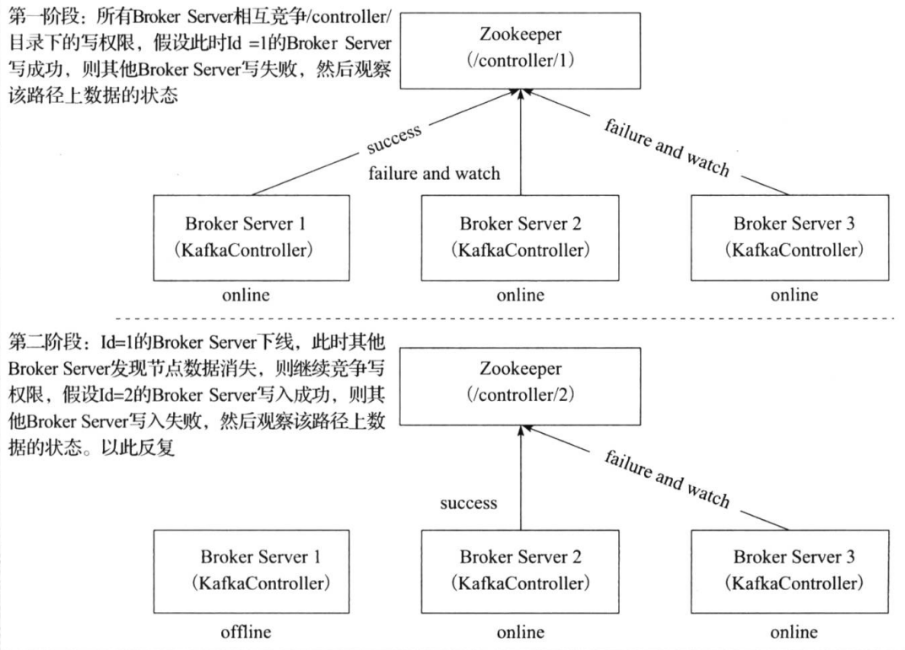
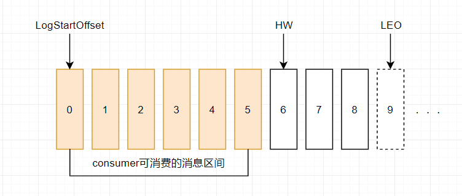

# Broker

## 存储文件


log默认保留168小时(7天)，默认一个segment文件大小1G，否则产生新文件

* `.log`存储数据
* `.index`存储索引(类似跳表的索引)

```java
############################# Log Retention Policy #############################

# The following configurations control the disposal of log segments. The policy can
# be set to delete segments after a period of time, or after a given size has accumulated.
# A segment will be deleted whenever *either* of these criteria are met. Deletion always happens
# from the end of the log.

# The minimum age of a log file to be eligible for deletion due to age
log.retention.hours=168

# A size-based retention policy for logs. Segments are pruned from the log unless the remaining
# segments drop below log.retention.bytes. Functions independently of log.retention.hours.
#log.retention.bytes=1073741824

# The maximum size of a log segment file. When this size is reached a new log segment will be created.
log.segment.bytes=1073741824

# The interval at which log segments are checked to see if they can be deleted according
# to the retention policies
log.retention.check.interval.ms=300000
```

### 索引的稀疏存储（类似跳表）

为数据文件建索引采取了稀疏存储：每隔一定字节的数据建立一条索引（这样的目的是为了减少索引文件的大小）


## leader选举

leader选举借助zookeeper最简单最直观的方案是:leader在zk上创建一个临时节点，所有Follower对此节点注册监听，当leader宕机时，此时ISR里的所有Follower都尝试创建该节点，而创建成功者（Zookeeper保证只有一个能创建成功）即是新的Leader，其它Replica即为Follower。

缺点：当kafka集群业务很多，partition达到成千上万时，当broker宕机时，造成集群内大量的调整，会造成大量Watch事件被触发，Zookeeper负载会过重，而zk是不适合大量写操作的。

kafka在所有broker中选出一个controller，所有Partition的Leader选举都由controller决定。controller会将Leader的改变直接通过RPC的方式（比Zookeeper Queue的方式更高效）通知需为此作出响应的Broker。同时controller也负责增删Topic以及Replica的重新分配。


### Kafka Controller 选举

Kafka Controller的选举是依赖Zookeeper来实现的，在Kafka集群中哪个broker能够成功创建`/controller`这个临时（EPHEMERAL）节点,就可以成为Kafka Controller。

controller实现如上功能：
* brokers列表：`ls /brokers/ids`
* 某个broker信息：`get /brokers/ids/0`
* topic信息：`get /brokers/topics/kafka10-topic-20170924`
* partition信息：`get /brokers/topics/kafka10-topic-20170924/partitions/0/state`
* controller中心节点变更次数：`get /controller_epoch`
* conrtoller leader信息：`get /controller`



### partition leader选举的触发

当创建分区（创建主题或增加分区都有创建分区的动作）或分区上线（比如分区中原先的leader副本下线，此时分区需要选举一个新的leader上线来对外提供服务）的时候都需要执行leader的选举动作。还有分区进行重分配（reassign）的时候也需要执行leader的选举动作。

### 如何选举出 partition leader？

不同场景下的选举思路不同；基本思路如下

1. 按照AR集合中副本的顺序查找第一个存活的副本，并且这个副本在ISR集合中。

2. 一个分区的AR集合在分配的时候就被指定，并且只要不发生重分配的情况，集合内部副本的顺序是保持不变的，而分区的ISR集合中副本的顺序可能会改变。注意这里是根据AR的顺序而不是ISR的顺序进行选举的。

3. 分区进行重分配（reassign）的时候也需要执行leader的选举动作。
思路：从重分配的AR列表中找到第一个存活的副本，且这副本在目前的ISR列表中。

4. 发生优先副本（preferred replica partition leader election）的选举时，直接将优先副本设置为leader即可，AR集合中的第一个副本即为优先副本。

5. 当某节点被优雅地关闭（也就是执行ControlledShutdown）时，位于这个节点上的leader副本都会下线，所以与此对应的分区需要执行leader的选举。从AR列表中找到第一个存活的副本，且这个副本在目前的ISR列表中，与此同时还要确保这个副本不处于正在被关闭的节点上。

## ISR

分区中的所有副本统称为AR（Assigned Repllicas）。

所有与leader副本保持一定程度同步的副本（包括Leader）组成ISR（In-Sync Replicas），ISR集合是AR集合中的一个子集。

ISR集合的副本必须满足：副本所在节点必须维持着与zookeeper的连接；副本最后一条消息的offset与leader副本最后一条消息的offset之间的差值不能超出指定的阈值

每个分区的leader副本都会维护此分区的ISR集合，写请求首先由leader副本处理，之后follower副本会从leader副本上拉取写入的消息，这个过程会有一定的延迟，导致follower副本中保存的消息略少于leader副本，只要未超出阈值都是可以容忍的

### HW LEO（leader follower的木桶理论/短板理论）

* HW （High Watermark）俗称高水位，它标识了一个特定的消息偏移量（offset），消费者只能拉取到这个offset之前的消息。

* LEO （Log End Offset），标识当前日志文件中下一条待写入的消息的offset。LEO 的大小相当于当前日志分区中最后一条消息的offset值加1. 分区 ISR 集合中的每个副本都会维护自身的 LEO ，而 ISR 集合中最小的 LEO 即为分区的 HW，对消费者而言只能消费 HW 之前的消息。




* leader LEO：leader的LEO就保存在其所在的broker的缓存里，当leader副本log文件写入消息后，就会更新自己的LEO

* remote LEO和follower LEO：remote LEO是保存在leader副本上的follower副本的LEO，可以看出leader副本上保存所有副本的LEO，当然也包括自己的。follower LEO就是follower副本的LEO
    1. 如果是remote LEO，更新前leader需要确认follower的fetch请求包含的offset，这个offset就是follower副本的LEO，根据它对remote LEO进行更新。如果更新时尚未收到fetch请求，或者fetch请求在请求队列中排队，则不做更新。可以看出在leader副本给follower副本返回数据之前，remote LEO就先更新了。
    2. 如果是follower LEO，它的更新是在follower副本得到leader副本发送的数据并随后写入到log文件，就会更新自己的LEO。

#### High Watermark的更新

* leader的HW是所有副本的最小LEO；
* follower的HW是从leader同步消息fetch时，leader的返回的HW与当前副本的LEO中取较小者；


1. follower从leader同步数据，发送fetch请求
2. follower获取到数据后写本地磁盘
3. follower更新当前副本的LEO
4. follower再次从leader同步数据，同时fetch请求里包含了自己的LEO（即把自己的LEO告诉leader）
5. leader更新保存的follower LEO
6. leader取所有副本最小的LEO作为HW（leader根据取短板LEO，最为最后的LEO）

## kafka集群怎么读取/写入数据到指定的broker分区，从指定broker的offset开始消费？

* 向指定的partition发送数据

`ProducerRecord` new的时候可以指定`partition`

* 从指定的partition开始消费数据

consumer可以指定从特定offset开始消费数据

* 从指定的partition的指定的offset开始消费数据

consumer.seek可以指定

## Zookeeper 在 Kafka 中的作用

### Broker注册

Broker是分布式部署并且相互之间相互独立，但是需要有一个注册系统能够将整个集群中的Broker管理起来，此时就使用到了Zookeeper。在Zookeeper上会有一个专门用来进行Broker服务器列表记录的节点。

### Topic注册

在Kafka中，同一个Topic的消息会被分成多个分区并将其分布在多个Broker上，这些分区信息及与Broker的对应关系也都是由Zookeeper在维护，由专门的节点来记录。

### 生产者负载均衡

由于同一个Topic消息会被分区并将其分布在多个Broker上，因此，生产者需要将消息合理地发送到这些分布式的Broker上，那么如何实现生产者的负载均衡，Kafka支持传统的四层负载均衡，也支持Zookeeper方式实现负载均衡。

使用Zookeeper进行负载均衡，由于每个Broker启动时，都会完成Broker注册过程，生产者会通过该节点的变化来动态地感知到Broker服务器列表的变更，这样就可以实现动态的负载均衡机制。

### 消费者负载均衡

与生产者类似，Kafka中的消费者同样需要进行负载均衡来实现多个消费者合理地从对应的Broker服务器上接收消息，每个消费者分组包含若干消费者，每条消息都只会发送给分组中的一个消费者，不同的消费者分组消费自己特定的Topic下面的消息，互不干扰。

### 分区 与 消费者 的关系

在Kafka中，规定了每个消息分区 只能被同组的一个消费者进行消费，因此，需要在 Zookeeper 上记录 消息分区 与 Consumer 之间的关系，每个消费者一旦确定了对一个消息分区的消费权力，需要将其Consumer ID 写入到 Zookeeper 对应消息分区的临时节点上

### 消费进度Offset 记录(1.0之前的版本)

在消费者对指定消息分区进行消息消费的过程中，需要定时地将分区消息的消费进度Offset记录到Zookeeper上，以便在该消费者进行重启或者其他消费者重新接管该消息分区的消息消费后，能够从之前的进度开始继续进行消息消费。

补充：

<font color='red'>早期版本的 kafka 用 zk 做 meta 信息存储</font>，consumer 的消费状态，group 的管理以及 offse t的值。考虑到zk本身的一些因素以及整个架构较大概率存在单点问题，<font color='red'>新版本中确实逐渐弱化了zookeeper的作用</font>。新的consumer使用了kafka内部的group coordination协议，也减少了对zookeeper的依赖。

## broker处理源码

### 通信协议

* Producer与Kafka集群：Producer需要利用ProducerRequest和TopicMetadataRequest来完成Topic元数据的查询、消息的发送
* Consumer和Kafka集群：Consumer需要利用TopicMetadataRequest请求、FetchRequest请求和ConsumerMetadataRequest请求来完成Topic元数据的查询、消息的订阅、历史偏移量的查询、偏移量的提交，当前偏移量的查询


