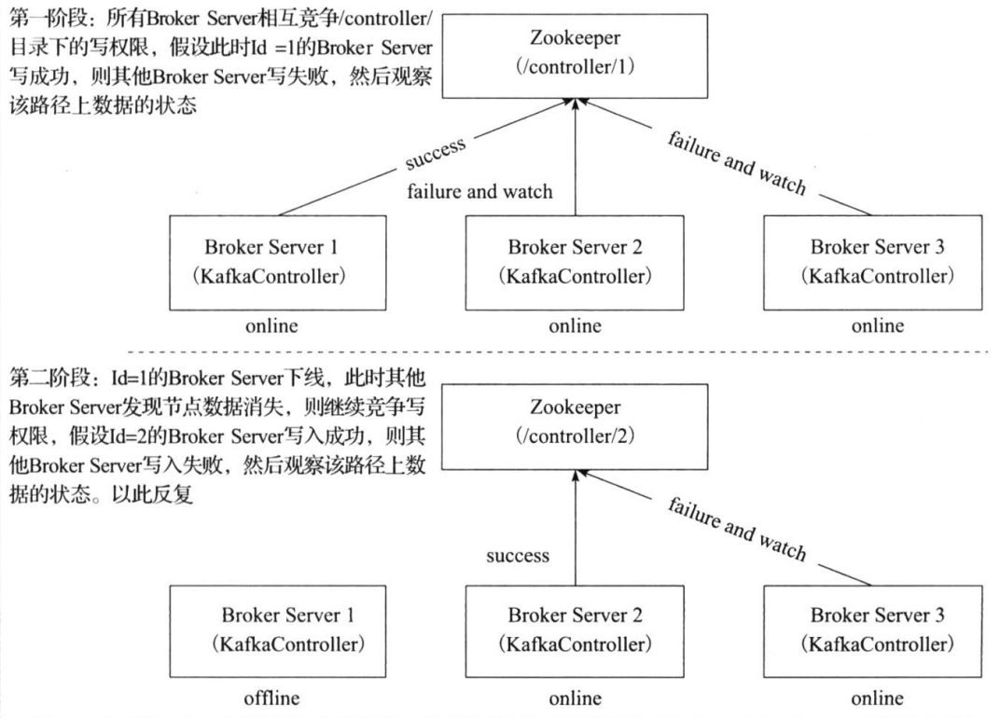

# kafka 的 controller 选举和 leader 选举

kafka在所有broker中选出一个controller(`Controller leader`)，所有Partition的Leader选举都由controller决定(`Partition leader`)。controller会将Leader的改变直接通过RPC的方式（比Zookeeper Queue的方式更高效）通知需为此作出响应的Broker。同时controller也负责增删Topic以及Replica的重新分配。

## 创建topic是partition如何分配到broker?

replica assignment有三个目标：
* 在brokers之间均分replicas
* partition与它的其他replicas不再同一个broker上
* 如果broker有rack信息，则partition的replicas尽量分配在不同rack上面

副本因子不能大于broker的个数

* 第0个分区的第一个副本放置位置是随机从brokerList中选择的
* 其它分区的第一个副本位置是相对于第0个分区往后移动（eg: 5个broker，5个分区，如果第0分区放到了broker4上，接着第1分区放broker5, 第2分区放broker1，第3分区放broker2，第4分区放到broker3上）
* 剩余副本相对于第一个副本放置位置其实是有`nextReplicaShift`决定的，而这个数也是随机产生的

```java
private def assignReplicasToBrokersRackUnaware(nPartitions: Int,
                                                 replicationFactor: Int,
                                                 brokerList: Seq[Int],
                                                 fixedStartIndex: Int,
                                                 startPartitionId: Int): Map[Int, Seq[Int]] = {
    val ret = mutable.Map[Int, Seq[Int]]()
    val brokerArray = brokerList.toArray
    val startIndex = if (fixedStartIndex >= 0) fixedStartIndex else rand.nextInt(brokerArray.length)
    var currentPartitionId = math.max(0, startPartitionId)
    var nextReplicaShift = if (fixedStartIndex >= 0) fixedStartIndex else rand.nextInt(brokerArray.length)
    for (_ <- 0 until nPartitions) {
      if (currentPartitionId > 0 && (currentPartitionId % brokerArray.length == 0))
        nextReplicaShift += 1
      val firstReplicaIndex = (currentPartitionId + startIndex) % brokerArray.length
      val replicaBuffer = mutable.ArrayBuffer(brokerArray(firstReplicaIndex))
      for (j <- 0 until replicationFactor - 1)
        replicaBuffer += brokerArray(replicaIndex(firstReplicaIndex, nextReplicaShift, j, brokerArray.length))
      ret.put(currentPartitionId, replicaBuffer)
      currentPartitionId += 1
    }
    ret
  }
 
 
  private def replicaIndex(firstReplicaIndex: Int, secondReplicaShift: Int, replicaIndex: Int, nBrokers: Int): Int = {
    val shift = 1 + (secondReplicaShift + replicaIndex) % (nBrokers - 1)
    (firstReplicaIndex + shift) % nBrokers
  }
```

## kafka的Replica

kafka的Replica

1. kafka的topic可以设置有N个副本（replica），副本数最好要小于broker的数量，也就是要保证一个broker上的replica最多有一个，所以可以用broker id指定Partition replica。

2. 创建副本的单位是topic的分区，每个分区有1个leader和0到多个follower，我们把多个replica分为Lerder replica和follower replica。

3. 当producer在向partition中写数据时，根据ack机制，默认ack=1，只会向leader中写入数据，然后leader中的数据会复制到其他的replica中，follower会周期性的从leader中pull数据，但是对于数据的读写操作都在leader replica中，follower副本只是当leader副本挂了后才重新选取leader，follower并不向外提供服务。

<font colore='red'>kafka不是完全同步，也不是完全异步，是一种特殊的ISR（In Sync Replica）</font>

1. leader会维持一个与其保持同步的replica集合，该集合就是ISR，每一个partition都有一个ISR，由leader动态维护。

2. 我们要保证kafka不丢失message，就要保证ISR这组集合存活（至少有一个存活），并且消息commit成功。

分布式消息系统对一个节点是否存活有这样两个条件判断：
* 第一个，节点必须维护和zookeeper的连接，zookeeper通过心跳机制检查每个节点的连接；
* 第二个，如果节点时follower，它必要能及时同步与leader的写操作，不是延时太久。

## Controller leader 选举

当broker启动的时候，都会创建KafkaController对象，但是集群中只能有一个leader对外提供服务，这些每个节点上的KafkaController会在指定的zookeeper路径下创建临时节点，只有第一个成功创建的节点的KafkaController才可以成为leader，其余的都是follower。当leader故障后，所有的follower会收到通知，再次竞争在该路径下创建节点从而选举新的leader



实际上的实现思路如上，只是优化了下，多了个代理控制管理类（controller）。引入的原因是，当kafka集群业务很多，partition达到成千上万时，当broker宕机时，造成集群内大量的调整，会造成大量Watch事件被触发，Zookeeper负载会过重。而zk是不适合大量写操作的。

## Partition leader 选举

由controller leader执行

* 从Zookeeper中读取当前分区的所有ISR(in-sync replicas)集合
* 调用配置的分区选择算法选择分区的leader

### kafka partition状态

* NonExistentPartition：这个状态表示该分区要么没有被创建过或曾经被创建过但后面被删除了。
* NewPartition：分区创建之后就处于NewPartition状态。在这个状态中，分区应该已经分配了副本，但是还没有选举出leader和ISR。
* OnlinePartition：一旦分区的leader被推选出来，它就处于OnlinePartition状态。
* OfflinePartition：如果leader选举出来后，leader broker宕机了，那么该分区就处于OfflinePartition状态。

### kafka选择分区leader算法

#### NoOpLeaderSelector

不做任何事情，仅仅返回下当前的Leader，ISR，AR

#### offlinePartitionLeader

当KafkaController尝试将分区状态从OfflinePartition或者NewPartion切换为OnlinePartition的时候会使用这种策略。

1. 筛选出在线的ISR和在线的AR
2. 优先在在线的ISR中选择，在线的ISR列表不为空，则选择在线ISR列表中的第一个，结束选举
3. 在线的ISR为空，则根据`unclean.leader.election.enable`的配置是否在在线的AR列表中选择，`unclean.leader.election.enable`代表了是否允许不在ISR列表中选举Leader，默认为true，如果为true，则选择在线AR中的第一个，结束选举；如果AR列表为空，则选举失败。

#### reassignedPartitionLeader

随着Topic的新建和删除以及Broker Server的上下线，原本Topic分区的AR列表在集群中的分布变得越来越不均匀了，此时如果管理员下发分区重分配的指令，就会在Zookeeper的`/admin/reassgin_partitions`目录下指定Topic分区的AR列表，此时Leader状态的KafkaController检测到这个路径的数据变化，会触发相应的回调函数，使得对应的Topic分区发生Leader Replica的选举

1. 获取指定的AR列表
2. 针对指定的AR列表，在线的Broker Server和当前的ISR列表求交集
3. 如果交集不为空，则选举成功，其第一个Replica即为新的leader；否则选举失败。

#### preferredReplicaPartitionLeader

1. 获取指定的AR列表
2. 选择第一额Replica作为特定的Leader Replica
3. 判断待定的Leader Replica是否在在线的Broker Server中和当前的ISR列表中，如果是，则选举成功，其第一个Replica即成为Leader；否则选举失败

#### ControlledShutdownLeader

当Broker Server下线的时候会向Leader状态的KafkaController下发ContolledShutdownRequest的指令，KafkaController接收到该指令之后会针对位于该Broker Server上的Leader Replica的分区重新进行Leader replica选举

1. 获取分区的ISR列表
2. 在SIT列表中剔除离线的Replica作为新的ISR列表
3. 如果新的ISR列表不为空，则选举成功，其第一个Replica即为新的Leader；否则选举失败

## 如何处理所有Replica都不工作？

在ISR中至少有一个follower时，Kafka可以确保已经commit的数据不丢失，但如果某个Partition的所有Replica都宕机了，就无法保证数据不丢失了。这种情况下有两种可行的方案：

1. 等待ISR中的任一个Replica"活"过来，并且选它作为Leader
2. 选择第一个"活"过来的Replica（不一定是ISR中的）作为Leader

这就需要在可用性和一致性当中作出一个简单的折衷。如果一定要等待ISR中的Replica“活”过来，那不可用的时间就可能会相对较长。而且如果ISR中的所有Replica都无法“活”过来了，或者数据都丢失了，这个Partition将永远不可用。选择第一个“活”过来的Replica作为Leader，而这个Replica不是ISR中的Replica，那即使它并不保证已经包含了所有已commit的消息，它也会成为Leader而作为consumer的数据源（前文有说明，所有读写都由Leader完成）。Kafka0.8.*使用了第二种方式。根据Kafka的文档，在以后的版本中，Kafka支持用户通过配置选择这两种方式中的一种，从而根据不同的使用场景选择高可用性还是强一致性。 unclean.leader.election.enable 参数决定使用哪种方案，默认是true，采用第二种方案
