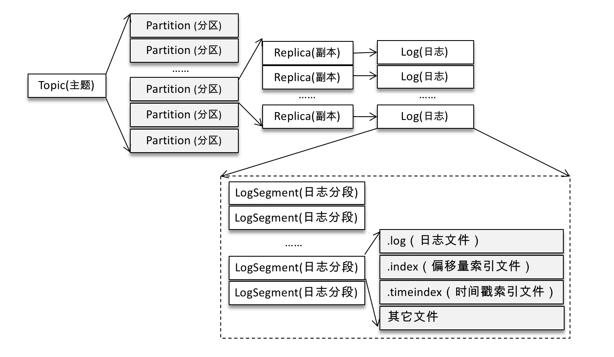

# broker 处理请求

## Kafka broker上对于producer发过来的消息的处理流程图


## Log对象

每个 replica 会对应一个 log 对象，log 对象是管理当前分区的一个单位，它会包含这个分区的所有 segment 文件（包括对应的 offset 索引和时间戳索引文件），它会提供一些增删查的方法。

在 Log 对象的初始化时，有如下的几个重要变量：

1. nextOffsetMetadata：可以叫做下一个偏移量元数据，它包括 activeSegment 的下一条消息的偏移量，该 activeSegment 的基准偏移量及日志分段的大小；
2. activeSegment：指的是该 Log 管理的 segments 中那个最新的 segment（这里叫做活跃的 segment），一个 Log 中只会有一个活跃的 segment，其他的 segment 都已经被持久化到磁盘了；
3. logEndOffset：表示下一条消息的 offset，它取自 nextOffsetMetadata 的 offset，实际上就是活动日志分段的下一个偏移量。

消息追加到日志中时，是以 segment 为单位的，当 segment 的大小到达阈值大小之后，会滚动新建一个日志分段（segment）保存新的消息，而分区的消息总是追加到最新的日志分段（也就是 activeSegment）中。每个日志分段都会有一个基准偏移量（segmentBaseOffset，或者叫做 baseOffset），这个基准偏移量就是分区级别的绝对偏移量，而且这个值在日志分段是固定的。有了这个基准偏移量，就可以计算出来每条消息在分区中的绝对偏移量，最后把数据以及对应的绝对偏移量写到日志文件中。

### 入口：`kafka.server.KafkaApis#handle`

```java
/**
* Handle a produce request
*/
def handleProduceRequest(request: RequestChannel.Request)
    ...

    // call the replica manager to append messages to the replicas
    replicaManager.appendRecords(
        timeout = produceRequest.timeout.toLong,
        requiredAcks = produceRequest.acks,
        internalTopicsAllowed = internalTopicsAllowed,
        isFromClient = true,
        entriesPerPartition = authorizedRequestInfo,
        responseCallback = sendResponseCallback,
        processingStatsCallback = processingStatsCallback)

    ...
```

### `kafka.server.ReplicaManager#appendRecords`

处理逻辑主要如下
1. 首先判断 acks 设置是否有效（-1，0，1三个值有效），无效的话直接返回异常，不再处理；
2. acks 设置有效的话，调用 appendToLocalLog() 方法将 records 追加到本地对应的 log 对象中；
3. appendToLocalLog() 处理完后，如果发现 clients 设置的 acks=-1，即需要 isr 的其他的副本同步完成才能返回 response，那么就会创建一个 DelayedProduce 对象，等待 isr 的其他副本进行同步，否则的话直接返回追加的结果。

```java
/**
   * Append messages to leader replicas of the partition, and wait for them to be replicated to other replicas;
   * the callback function will be triggered either when timeout or the required acks are satisfied;
   * if the callback function itself is already synchronized on some object then pass this object to avoid deadlock.
   */
  def appendRecords(timeout: Long,
                    requiredAcks: Short,
                    internalTopicsAllowed: Boolean,
                    isFromClient: Boolean,
                    entriesPerPartition: Map[TopicPartition, MemoryRecords],
                    responseCallback: Map[TopicPartition, PartitionResponse] => Unit,
                    delayedProduceLock: Option[Lock] = None,
                    processingStatsCallback: Map[TopicPartition, RecordsProcessingStats] => Unit = _ => ()) {
    if (isValidRequiredAcks(requiredAcks)) {
      val sTime = time.milliseconds
      // 向本地的副本 log 追加数据
      val localProduceResults = appendToLocalLog(internalTopicsAllowed = internalTopicsAllowed,
        isFromClient = isFromClient, entriesPerPartition, requiredAcks)
      debug("Produce to local log in %d ms".format(time.milliseconds - sTime))

      val produceStatus = localProduceResults.map { case (topicPartition, result) =>
        topicPartition ->
                ProducePartitionStatus(
                  result.info.lastOffset + 1, // required offset
                  new PartitionResponse(result.error, result.info.firstOffset, result.info.logAppendTime, result.info.logStartOffset)) // response status
      }

      processingStatsCallback(localProduceResults.mapValues(_.info.recordsProcessingStats))

      if (delayedProduceRequestRequired(requiredAcks, entriesPerPartition, localProduceResults)) {
        // 处理 ack=-1 的情况,需要等到 isr 的 follower 都写入成功的话,才能返回最后结果  
        // create delayed produce operation
        val produceMetadata = ProduceMetadata(requiredAcks, produceStatus)
        val delayedProduce = new DelayedProduce(timeout, produceMetadata, this, responseCallback, delayedProduceLock)

        // create a list of (topic, partition) pairs to use as keys for this delayed produce operation
        val producerRequestKeys = entriesPerPartition.keys.map(new TopicPartitionOperationKey(_)).toSeq

        // try to complete the request immediately, otherwise put it into the purgatory
        // this is because while the delayed produce operation is being created, new
        // requests may arrive and hence make this operation completable.
        delayedProducePurgatory.tryCompleteElseWatch(delayedProduce, producerRequestKeys)

      } else {
        // we can respond immediately
        val produceResponseStatus = produceStatus.mapValues(status => status.responseStatus)
        responseCallback(produceResponseStatus)
      }
    } else {
      // If required.acks is outside accepted range, something is wrong with the client
      // Just return an error and don't handle the request at all
      val responseStatus = entriesPerPartition.map { case (topicPartition, _) =>
        topicPartition -> new PartitionResponse(Errors.INVALID_REQUIRED_ACKS,
          LogAppendInfo.UnknownLogAppendInfo.firstOffset, RecordBatch.NO_TIMESTAMP, LogAppendInfo.UnknownLogAppendInfo.logStartOffset)
      }
      responseCallback(responseStatus)
    }
  }
```

* acks：-1，0，1 三个值

```java
private def isValidRequiredAcks(requiredAcks: Short): Boolean = {
    requiredAcks == -1 || requiredAcks == 1 || requiredAcks == 0
}
```

1. acks=0，生产者成功写入消息之前不会等待来自任何服务器的响应，这种配置，提高吞吐量，但是消息存在丢失风险。
2. acks=1(默认)，只要集群的leader（master）收到了消息，生产者将会受到发送成功的一个响应，如果消息无撞到达首领节点（比如首领节点崩愤，新的首领还没有被选举出来），生产者会收到一个错误响应，为了避免数据丢失，生产者会重发消息。不过，如果一个没有收到消息的节点成为新首领，消息还是会丢失。这个时候的吞吐量取决于使用的是
同步发送还是异步发送。如果让发送客户端等待服务器的响应（通过调用Fututre 对象的get（）方法，显然会增加延迟（在网络上传输一个来回的延迟）。如果客户端使用回调，延迟问题就可以得到缓解，不过吞吐量还是会受发送中消息数量的限制（比如，生产者在收到服务器响应之前可以发送多少个消息）。
3. acks=-1，所有参与复制的节点全部收到消息的时候，生产者才会收到来自服务器的一个响应，这种模式最安全，但是吞吐量受限制，它可以保证不止一个服务器收到消息，就算某台服务器奔溃，那么整个集群还是会正产运转。

* `kafka.server.ReplicaManager#appendToLocalLog`

```java
/**
   * Append the messages to the local replica logs
   */
  private def appendToLocalLog(internalTopicsAllowed: Boolean,
                               isFromClient: Boolean,
                               entriesPerPartition: Map[TopicPartition, MemoryRecords],
                               requiredAcks: Short): Map[TopicPartition, LogAppendResult] = {
    trace(s"Append [$entriesPerPartition] to local log")
    entriesPerPartition.map { case (topicPartition, records) =>
      brokerTopicStats.topicStats(topicPartition.topic).totalProduceRequestRate.mark()
      brokerTopicStats.allTopicsStats.totalProduceRequestRate.mark()

      // reject appending to internal topics if it is not allowed
      if (Topic.isInternal(topicPartition.topic) && !internalTopicsAllowed) {
        (topicPartition, LogAppendResult(
          LogAppendInfo.UnknownLogAppendInfo,
          Some(new InvalidTopicException(s"Cannot append to internal topic ${topicPartition.topic}"))))
      } else {
        try {
          val partitionOpt = getPartition(topicPartition)
          val info = partitionOpt match {
            case Some(partition) =>
              if (partition eq ReplicaManager.OfflinePartition)
                throw new KafkaStorageException(s"Partition $topicPartition is in an offline log directory on broker $localBrokerId")
              // 追加records到leader上
              partition.appendRecordsToLeader(records, isFromClient, requiredAcks)

            case None => throw new UnknownTopicOrPartitionException("Partition %s doesn't exist on %d"
              .format(topicPartition, localBrokerId))
          }

          val numAppendedMessages =
            if (info.firstOffset == -1L || info.lastOffset == -1L)
              0
            else
              info.lastOffset - info.firstOffset + 1

          // update stats for successfully appended bytes and messages as bytesInRate and messageInRate
          brokerTopicStats.topicStats(topicPartition.topic).bytesInRate.mark(records.sizeInBytes)
          brokerTopicStats.allTopicsStats.bytesInRate.mark(records.sizeInBytes)
          brokerTopicStats.topicStats(topicPartition.topic).messagesInRate.mark(numAppendedMessages)
          brokerTopicStats.allTopicsStats.messagesInRate.mark(numAppendedMessages)

          trace("%d bytes written to log %s-%d beginning at offset %d and ending at offset %d"
            .format(records.sizeInBytes, topicPartition.topic, topicPartition.partition, info.firstOffset, info.lastOffset))
          (topicPartition, LogAppendResult(info))
        } catch {
          // NOTE: Failed produce requests metric is not incremented for known exceptions
          // it is supposed to indicate un-expected failures of a broker in handling a produce request
          case e@ (_: UnknownTopicOrPartitionException |
                   _: NotLeaderForPartitionException |
                   _: RecordTooLargeException |
                   _: RecordBatchTooLargeException |
                   _: CorruptRecordException |
                   _: KafkaStorageException |
                   _: InvalidTimestampException) =>
            (topicPartition, LogAppendResult(LogAppendInfo.UnknownLogAppendInfo, Some(e)))
          case t: Throwable =>
            val logStartOffset = getPartition(topicPartition) match {
              case Some(partition) =>
                partition.logStartOffset
              case _ =>
                -1
            }
            brokerTopicStats.topicStats(topicPartition.topic).failedProduceRequestRate.mark()
            brokerTopicStats.allTopicsStats.failedProduceRequestRate.mark()
            error("Error processing append operation on partition %s".format(topicPartition), t)
            (topicPartition, LogAppendResult(LogAppendInfo.unknownLogAppendInfoWithLogStartOffset(logStartOffset), Some(t)))
        }
      }
    }
  }
```

### `kafka.cluster.Partition#appendRecordsToLeader`

Partition组件是topic在某个broker上一个副本的抽象。每个partition对象都会维护一个Replica对象，Replica对象中又维护Log对象，也就是数据目录的抽象

```java
def appendRecordsToLeader(records: MemoryRecords, requiredAcks: Int = 0) = {
    val (info, leaderHWIncremented) = inReadLock(leaderIsrUpdateLock) {
      leaderReplicaIfLocal match {
          //写之前先判断该replica是否是leader，如果不是leader则没有写权限
        case Some(leaderReplica) =>
          //获取该partition的log对象
          val log = leaderReplica.log.get
          //获取配置的minInSyncReplicas值
          val minIsr = log.config.minInSyncReplicas
          //当前ISR的数量
          val inSyncSize = inSyncReplicas.size

          // 如果请求的acks=-1，但是当前的ISR比配置的minInSyncReplicas还小，那要抛出错误，表示当前ISR不足
          if (inSyncSize < minIsr && requiredAcks == -1) {
            throw new NotEnoughReplicasException("Number of insync replicas for partition %s is [%d], below required minimum [%d]"
              .format(topicPartition, inSyncSize, minIsr))
          }
          //调用log的append方法写入消息
          val info = log.append(records, assignOffsets = true)
          // probably unblock some follower fetch requests since log end offset has been updated
          replicaManager.tryCompleteDelayedFetch(TopicPartitionOperationKey(this.topic, this.partitionId))
          // we may need to increment high watermark since ISR could be down to 1
          (info, maybeIncrementLeaderHW(leaderReplica))

        case None =>
          throw new NotLeaderForPartitionException("Leader not local for partition %s on broker %d"
            .format(topicPartition, localBrokerId))
      }
    }

    // some delayed operations may be unblocked after HW changed
    if (leaderHWIncremented)
      tryCompleteDelayedRequests()

    info
  }
```

这里的步骤总结

1. 先判断自己是否是leader，只有leader才可以接收producer请求然后写数据
2. 判断当前的当前的ISR数量是否比minInSyncReplicas还小，如果ISR数量小于minInSyncReplicas就抛出异常
3. 把消息交给自己管理的Log组件处理

### `kafka.log.Log#appendAsLeader`

Log对象是对partition数据目录的抽象。管理着某个topic在某个broker的一个partition,它可能是一个leader，也可能是replica。同时，Log对象还同时管理着多个LogSegment，也就是日志的分段。

回顾kafka log文件结构：



```java
/**
* Append this message set to the active segment of the log, assigning offsets and Partition Leader Epochs
*
* @param records The records to append
* @param isFromClient Whether or not this append is from a producer
* @throws KafkaStorageException If the append fails due to an I/O error.
* @return Information about the appended messages including the first and last offset.
*/
def appendAsLeader(records: MemoryRecords, leaderEpoch: Int, isFromClient: Boolean = true): LogAppendInfo = {
    append(records, isFromClient, assignOffsets = true, leaderEpoch)
}
```

1. Log组件拿到消息后，对消息内容进行校验以及裁剪，然后设置每一条消息的offset。还会计算当前这批消息的最大时间戳是多少，即maxTimestamp，这个时间戳和日志保留时间有着密切关系
2. 还会校验要写入的消息数量是否大于一个segment所能容纳的最大限制，这个限制和配置segment.bytes有关系
3. 写入到segment之前还要判断如果把这些消息写入segment，会不会导致segment超出segment.bytes的大小，如果会的话，要新建一个新的segment用于日志写入
4. 把消息传过最新活跃的LogSegment处理

```java
def append(records: MemoryRecords, assignOffsets: Boolean = true): LogAppendInfo = {
    //判断消息格式是否正确.分析消息的压缩格式
    val appendInfo = analyzeAndValidateRecords(records)

    //如果没有一条消息格式正确，直接返回
    if (appendInfo.shallowCount == 0)
      return appendInfo

    //裁剪一些错误的数据
    var validRecords = trimInvalidBytes(records, appendInfo)

    try {
      lock synchronized {
        //需要给消息分配offset的话
        if (assignOffsets) {
          // 计算第一条消息的offset
          val offset = new LongRef(nextOffsetMetadata.messageOffset)
          appendInfo.firstOffset = offset.value
          val now = time.milliseconds
          val validateAndOffsetAssignResult = try {
            //给每一条消息设置offset。并且找出maxTimestamp以及maxTimestamp对于的offset
            LogValidator.validateMessagesAndAssignOffsets(validRecords,
                                                          offset,
                                                          now,
                                                          appendInfo.sourceCodec,
                                                          appendInfo.targetCodec,
                                                          config.compact,
                                                          config.messageFormatVersion.messageFormatVersion,
                                                          config.messageTimestampType,
                                                          config.messageTimestampDifferenceMaxMs)
          } catch {
            case e: IOException => throw new KafkaException("Error in validating messages while appending to log '%s'".format(name), e)
          }
          //获取有效的记录，然后根据这些记录设置响应的返回内容
          validRecords = validateAndOffsetAssignResult.validatedRecords
          //消息的最大时间戳和配置的messageTimestampType有关系。当前获取消息maxTimestamp时间戳的方式有两种。
          //1. 根据消息的timestamp来设置时间戳
          //2. 根据消息的写入时间来设置时间戳,也就是当前时间
          appendInfo.maxTimestamp = validateAndOffsetAssignResult.maxTimestamp
          appendInfo.offsetOfMaxTimestamp = validateAndOffsetAssignResult.shallowOffsetOfMaxTimestamp
          appendInfo.lastOffset = offset.value - 1
          if (config.messageTimestampType == TimestampType.LOG_APPEND_TIME)
            appendInfo.logAppendTime = now

          // 由于前面的操作可能导致消息压缩格式改变以及消息格式改变，因此这里还需要重新检查一下当前的每条消息大小是否超过maxMessageSize的配置大小
          if (validateAndOffsetAssignResult.messageSizeMaybeChanged) {
            for (logEntry <- validRecords.shallowEntries.asScala) {
              if (logEntry.sizeInBytes > config.maxMessageSize) {
                // we record the original message set size instead of the trimmed size
                // to be consistent with pre-compression bytesRejectedRate recording
                BrokerTopicStats.getBrokerTopicStats(topicPartition.topic).bytesRejectedRate.mark(records.sizeInBytes)
                BrokerTopicStats.getBrokerAllTopicsStats.bytesRejectedRate.mark(records.sizeInBytes)
                throw new RecordTooLargeException("Message size is %d bytes which exceeds the maximum configured message size of %d."
                  .format(logEntry.sizeInBytes, config.maxMessageSize))
              }
            }
          }

        } else {
          // we are taking the offsets we are given
          if (!appendInfo.offsetsMonotonic || appendInfo.firstOffset < nextOffsetMetadata.messageOffset)
            throw new IllegalArgumentException("Out of order offsets found in " + records.deepEntries.asScala.map(_.offset))
        }

        // 要写入的消息大小不能比一个segment的大小还大
        if (validRecords.sizeInBytes > config.segmentSize) {
          throw new RecordBatchTooLargeException("Message set size is %d bytes which exceeds the maximum configured segment size of %d."
            .format(validRecords.sizeInBytes, config.segmentSize))
        }

        // 判断是否需要新建一个segment
        val segment = maybeRoll(messagesSize = validRecords.sizeInBytes,
          maxTimestampInMessages = appendInfo.maxTimestamp,
          maxOffsetInMessages = appendInfo.lastOffset)


        //调用segment的方法添加消息
        segment.append(firstOffset = appendInfo.firstOffset,
          largestOffset = appendInfo.lastOffset,
          largestTimestamp = appendInfo.maxTimestamp,
          shallowOffsetOfMaxTimestamp = appendInfo.offsetOfMaxTimestamp,
          records = validRecords)

        updateLogEndOffset(appendInfo.lastOffset + 1)

        trace("Appended message set to log %s with first offset: %d, next offset: %d, and messages: %s"
          .format(this.name, appendInfo.firstOffset, nextOffsetMetadata.messageOffset, validRecords))
        //判断是否需要将消息刷盘
        if (unflushedMessages >= config.flushInterval)
          flush()

        appendInfo
      }
    } catch {
      case e: IOException => throw new KafkaStorageException("I/O exception in append to log '%s'".format(name), e)
    }
  }
```

### `kafka.log.LogSegment#append`

LogSegment是partition目录中数据段的抽象，kafka会将一个副本中日志根据配置分段。这个LogSegment对象维护数据文件以及索引文件的信息。

```scala
def append(firstOffset: Long, largestOffset: Long, largestTimestamp: Long, shallowOffsetOfMaxTimestamp: Long, records: MemoryRecords) {
    if (records.sizeInBytes > 0) {
      trace("Inserting %d bytes at offset %d at position %d with largest timestamp %d at shallow offset %d"
        .format(records.sizeInBytes, firstOffset, log.sizeInBytes(), largestTimestamp, shallowOffsetOfMaxTimestamp))
      //记录要插入的第一条消息的物理地址，后面生成索引的时候会用到
      val physicalPosition = log.sizeInBytes()
      if (physicalPosition == 0)
        rollingBasedTimestamp = Some(largestTimestamp)
      //判断是否可以安全写入消息
      require(canConvertToRelativeOffset(largestOffset), "largest offset in message set can not be safely converted to relative offset.")
      //将消息写入到fileChannel
      val appendedBytes = log.append(records)
      trace(s"Appended $appendedBytes to ${log.file()} at offset $firstOffset")
      //随时更新segment的maxTimestampSoFar值。
      // 这个时间的获取和message.timestamp.type配置有关系。可能获取当前时间作为largestTimestamp，也可能获取日志的最大timestamp作为largestTimestamp
      if (largestTimestamp > maxTimestampSoFar) {
        maxTimestampSoFar = largestTimestamp
        offsetOfMaxTimestamp = shallowOffsetOfMaxTimestamp
      }
      //判断是否需要追加一条索引记录。当bytesSinceLastIndexEntry大于配置的indexIntervalBytes值时会追加新的所有记录
      //bytesSinceLastIndexEntry会随着消息的写入不断增加，直到生成一条新的索引记录后重置为0
      //indexIntervalBytes和broker的配置有关
      if (bytesSinceLastIndexEntry > indexIntervalBytes) {
        index.append(firstOffset, physicalPosition)
        timeIndex.maybeAppend(maxTimestampSoFar, offsetOfMaxTimestamp)
        bytesSinceLastIndexEntry = 0
      }
      bytesSinceLastIndexEntry += records.sizeInBytes
    }
  }
```

1. logSegment底层使用了FileChannel写日志,写完之后还会判断是否要更新当前logSegment的最大时间戳
2. 每当写入消息的大小积累到一定程度时，会新插入一条索引记录。这个积累的大小和配置index.interval.bytes有关系

Java FileChannel: FileChannel是一个连接到文件的通道。除了读写操作之外，还有裁剪特定大小文件truncate()，强制将内存中的数据刷新到硬盘中`force()`，对通道上锁`lock()`等功能。零拷贝是通过java.nio.channels.FileChannel中的transferTo方法来实现的。transferTo方法底层是基于操作系统的sendfile这个system call来实现的

## follower 如何同步leader的数据？


1. follower从leader同步数据，发送fetch请求
2. follower获取到数据后写本地磁盘
3. follower更新当前副本的LEO
4. follower再次从leader同步数据，同时fetch请求里包含了自己的LEO（即把自己的LEO告诉leader）
5. leader更新保存的follower LEO
6. leader取所有副本最小的LEO作为HW（leader根据取短板LEO，最为最后的LEO）

* Kafka中partition replica复制机制：

Kafka中每个Broker启动时都会创建一个副本管理服务(ReplicaManager)，该服务负责维护ReplicaFetcherThread与其他Broker链路连接关系，该Broker中存在多少Follower的partitions对应leader partitions分布在不同的Broker上，有多少Broker就会创建相同数量的ReplicaFetcherThread线程同步对应partition数据，Kafka中partition间复制数据是由follower(扮演consumer角色)主动向leader获取消息，follower每次读取消息都会更新HW状态。

每当Follower的partitions发生变更影响leader所在Broker变化时，ReplicaManager就会新建或销毁相应的ReplicaFetcherThread。

* 如何保证一致性：

当Producer发送消息到leader partition所在Broker时，首先保证leader commit消息成功，然后创建一个"生产者延迟请求任务"，并判断当前partition的HW是否大于等于logEndOffset，如果满足条件即表示本次Producer请求partition replicas之间数据已经一致，立即向Producer返回Ack。否则待Follower批量拉取Leader的partition消息时，同时更新Leader ISR中HW，然后检查是否满足上述条件，如果满足向Producer返回Ack
