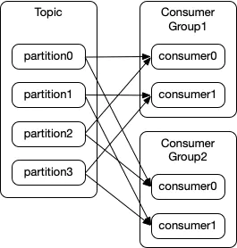
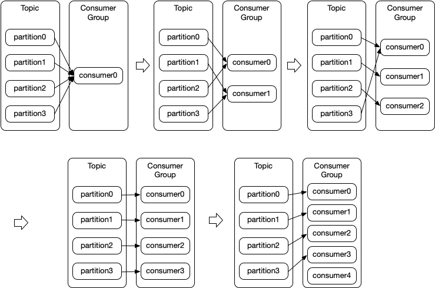
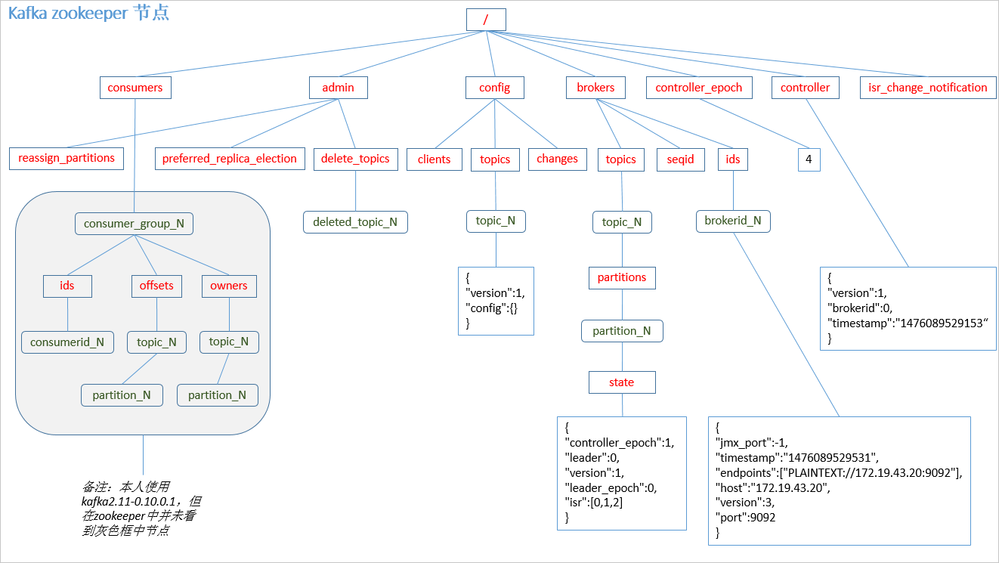
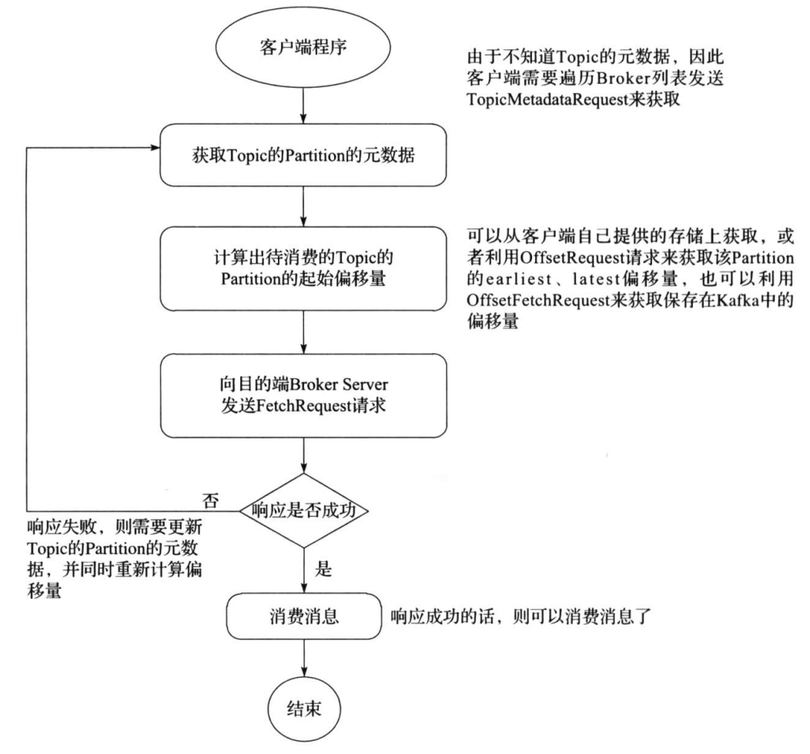

# Consumer

## consumer采用pull（拉）模式从broker中读取数据？

push（推）模式很难适应消费速率不同的消费者，因为消息发送速率是由broker决定的。它的目标是尽可能以最快速度传递消息，但是这样很容易造成consumer来不及处理消息，典型的表现就是拒绝服务以及网络拥塞。而pull模式则可以根据consumer的消费能力以适当的速率消费消息。

pull模式不足之处是，如果kafka没有数据，消费者可能会陷入循环中，一直返回空数据。针对这一点，Kafka的消费者在消费数据时会传入一个时长参数timeout，如果当前没有数据可供消费，consumer会等待一段时间之后再返回，这段时长即为timeout

## Consumer Group(消费组)

consumer group是kafka提供的可扩展且具有容错性的消费者机制

1. 一个消费组可以有多个消费者或消费者实例(consumer instance)
2. 一个消费组下的所有消费者共享一个公共的ID，即group ID
3. 一个消费组下订阅的topic下的每个partition只能分配给该group下的一个consumer(当然该分区还可以被分配给其他group)，即一个partition只能被一个消费进程/线程消费，而不能被多个消费进程/线程消费(当然一个消费进程/线程可以消费多个partition)
4. 每一个消费组都会被记录它在某一个分区的Offset，即不同consumer group针对同一个分区，都有"各自"的偏移量

### 同一个 Topic 可以多个消费组



### 再均衡（Rebalance）

再平衡，指的是在kafka consumer所订阅的topic发生变化时发生的一种分区重分配机制。一般有三种情况会触发再平衡：

1. consumer group中的新增或删除某个consumer，导致其所消费的分区需要分配到组内其它的consumer上；
2. consumer订阅的topic发生变化，比如订阅的topic采用的是正则表达式的形式，如`test-*`，此时如果有一个新建了一个topic:`test-user`过来，那么这个topic的所有分区也是会自动分配给当前的consumer的，此时就会发生再平衡；
3. consumer所订阅的topic发生了`新增partition`的行为，那么新增的分区就会分配给当前的consumer，此时就会触发再平衡。

eg:有一个 Topic 有4个分区，有一个消费者组订阅了这个 Topic，随着组中的消费者数量从1个增加到5个时，Topic 中分区被读取的情况如下



所以：<font color='red'>一个消费组中 consumer 的数量超过分区数，多出的 consumer 会被闲置。因此，如果想提高消费者的并行处理能力，需要设置足够多的 partition 数量</font>

#### 再均衡策略(默认:Range)

* Round Robin：会采用轮询的方式将当前所有的分区依次分配给所有的consumer；
* Range：首先会计算每个consumer可以消费的分区个数，然后按照顺序将指定个数范围的分区分配给各个consumer；
* Sticky：这种分区策略是最新版本中新增的一种策略，其主要实现了两个目的：
-- 将现有的分区尽可能均衡的分配给各个consumer，存在此目的的原因在于Round Robin和Range分配策略实际上都会导致某几个consumer承载过多的分区，从而导致消费压力不均衡；
-- 如果发生再平衡，那么在重新分配前的基础上会尽力保证当前未宕机的consumer所消费的分区不会被分配给其它的consumer上；

#### 再均衡影响

Rebalance本身是Kafka集群的一个保护设定，用于剔除掉无法消费或者过慢的消费者，然后由于我们的数据量较大，同时后续消费后的数据写入需要走网络IO，很有可能存在依赖的第三方服务存在慢的情况而导致我们超时。
Rebalance对我们数据的影响主要有以下几点：

* 数据重复消费: 消费过的数据由于提交offset任务也会失败，在partition被分配给其它消费者的时候，会造成重复消费，数据重复且增加集群压力
* Rebalance扩散到整个ConsumerGroup的所有消费者，因为一个消费者的退出，导致整个Group进行了Rebalance，并在一个比较慢的时间内达到稳定状态，影响面较大
* 频繁的Rebalance反而降低了消息的消费速度，大部分时间都在重复消费和Rebalance
* 数据不能及时消费，会累积lag，在Kafka的TTL之后会丢弃数据

## 消费者数据的不丢失？

通过offset commit来保证数据的不丢失。kafka自己记录了每次消费的offset数值，下次消费的时候从上次的offset继续消费

而offset的信息在kafka0.9版本之前保存在zookeeper中，在0.9版本后保存到了一个topic中，即使消费者在运行过程中挂掉了，再次启动的时候会找到offset的值，即可接着上次消费。由于offset的信息写入的时候并不是每条消息消费完成就写入，所以会导致有重复消费的问题，但是不会丢失消息

唯一例外的情况是，我们在程序中给原本做不同功能的两个consumer组设置了KafkaSpoutConfig.builder.setGroupid的时候设置成了同样的groupid,这种情况会导致这两个组共享了同一份数据，就会产生组A消费partition1，partition2中的消息，组B消费partition3的消息，这样每个组消费的消息都会丢失，都是不完整的。为了保证每个组都能独享一份消息数据，groupid一定不要重复

### offset的维护（zookeeper维护）

Kafka 0.9版本之前，consumer默认将offset保存在Zookeeper中，从0.9版本开始，consumer默认将offset保存在Kafka一个内置的topic中，该topic为__consumer_offsets



### offset的维护（内置topic`__consumer_offsets`维护）

kafka在0.10.x版本后默认将消费者组的位移提交到自带的topic:`__consumer_offsets`里面,当有消费者第一次消费kafka数据时就会自动创建，它的副本数不受集群配置的topic副本数限制，分区数默认50（可以配置），默认压缩策略为compact

key
* version : 版本字段，不同kafka版本的version不同
* group : 对应消费者组的groupid，这条消息要发送到__consumer_offset的哪个分区,是由这个字段决定的
* topic : 主题名称
* partition : 主题的分区

value
* version : 版本字段，不同kafka版本的version不同
* offset : 这个groupid消费这个topic到哪个位置了，offset的下一个值
* metadata : 自定义元数据信息
* commit_timestamp : 提交到kafka的时间
* expire_timestamp : 过期时间, 当数据过期时会有一个定时任务去清理过期的消息

#### 计算消息提交到__consumer_offsets哪个分区?

topic:`__consumer_offsets`的默认分区50，消费组的offset信息究竟落到那个partition，直接hash取模如下

`Math.abs("test".hashCode()) % 50` = 48, 表示test这个groupid的offset记录提交到了__consumer_offset的48号分区里

### 提交offset

offset提交的方式有两种：自动提交和手动提交。

offset下标自动提交其实在很多场景都不适用，因为自动提交是在kafka拉取到数据之后就直接提交，这样很容易丢失数据，尤其是在需要事物控制的时候。很多情况下我们需要从kafka成功拉取数据之后，对数据进行相应的处理之后再进行提交。如拉取数据之后进行写入mysql这种，所以这时我们就需要进行手动提交kafka的offset下标。

手动提交偏移量:
    1. 同步提交
    2. 异步提交
    3. 异步+同步 组合的方式提交

#### 同步提交offset

同步模式下提交失败的时候一直尝试提交，直到遇到无法重试的情况下才会结束，同时同步方式下消费者线程在拉取消息会被阻塞，在broker对提交的请求做出响应之前，会一直阻塞直到偏移量提交操作成功或者在提交过程中发生异常，限制了消息的吞吐量。只有当前批次的消息提交完成时才会触发poll来获取下一轮的消息。

```java
import org.apache.kafka.clients.consumer.ConsumerRecord;
import org.apache.kafka.clients.consumer.ConsumerRecords;
import org.apache.kafka.clients.consumer.KafkaConsumer;

import java.util.Arrays;
import java.util.Properties;

public class CustomComsumer {

    public static void main(String[] args) {

        Properties props = new Properties();
        //Kafka集群
        props.put("bootstrap.servers", "hadoop102:9092"); 
        //消费者组，只要group.id相同，就属于同一个消费者组
        props.put("group.id", "test"); 
        props.put("enable.auto.commit", "false");//关闭自动提交offset
        props.put("key.deserializer", "org.apache.kafka.common.serialization.StringDeserializer");
        props.put("value.deserializer", "org.apache.kafka.common.serialization.StringDeserializer");
        KafkaConsumer<String, String> consumer = new KafkaConsumer<>(props);
        consumer.subscribe(Arrays.asList("first"));//消费者订阅主题
        while (true) {
            //消费者拉取数据
            ConsumerRecords<String, String> records = consumer.poll(100); 
            for (ConsumerRecord<String, String> record : records) {
                System.out.printf("offset = %d, key = %s, value = %s%n", record.offset(), record.key(), record.value());
            }
            // 同步提交，当前线程会阻塞直到offset提交成功
            consumer.commitSync();
        }
    }
}
```

#### 异步提交offset

异步手动提交offset时，消费者线程不会阻塞，提交失败的时候也不会进行重试，并且可以配合回调函数在broker做出响应的时候记录错误信息。对于异步提交，由于不会进行失败重试，当消费者异常关闭或者触发了再均衡前，如果偏移量还未提交就会造成偏移量丢失。

```java
import org.apache.kafka.clients.consumer.*;
import org.apache.kafka.common.TopicPartition;

import java.util.Arrays;
import java.util.Map;
import java.util.Properties;


public class CustomConsumer {

    public static void main(String[] args) {

        Properties props = new Properties();
        //Kafka集群
        props.put("bootstrap.servers", "hadoop102:9092"); 
        //消费者组，只要group.id相同，就属于同一个消费者组
        props.put("group.id", "test"); 
        //关闭自动提交offset
        props.put("enable.auto.commit", "false");
        props.put("key.deserializer", "org.apache.kafka.common.serialization.StringDeserializer");
        props.put("value.deserializer", "org.apache.kafka.common.serialization.StringDeserializer");
        KafkaConsumer<String, String> consumer = new KafkaConsumer<>(props);
        consumer.subscribe(Arrays.asList("first"));//消费者订阅主题

        while (true) {
            ConsumerRecords<String, String> records = consumer.poll(100);//消费者拉取数据
            for (ConsumerRecord<String, String> record : records) {
                System.out.printf("offset = %d, key = %s, value = %s%n", record.offset(), record.key(), record.value());
            }
            //异步提交
            consumer.commitAsync(new OffsetCommitCallback() {
                @Override
                public void onComplete(Map<TopicPartition, OffsetAndMetadata> offsets, Exception exception) {
                    if (exception != null) {
                        System.err.println("Commit failed for" + offsets);
                    }
                }
            }); 
        }
    }
}
```

#### 异步+同步 组合的方式提交偏移量

针对异步提交偏移量丢失的问题，通过对消费者进行异步批次提交并且在关闭时同步提交的方式，这样即使上一次的异步提交失败，通过同步提交还能够进行补救，同步会一直重试，直到提交成功。通过finally在最后不管是否异常都会触发consumer.commit()来同步补救一次，确保偏移量不会丢失。

## 低级消费者(或简单消费者)



## 高级消费者

* 问题一: Kafka 高级消费者怎样才能达到最大吞吐量?

答:分区数量与线程数量一致。

* 问题二: 消费者消费能力不足时，如果提高并发?

答:1. 增加分区个数; 2. 增加消费者线程数; 3.自动提交 offset

* 在高阶消费者中，Offset 采用自动提交的方式。

自动提交时，假设 1s 提交一次 offset 的更新，设当前 offset=10，当消费者消费了 0.5s 的数据，offset 移动了 15，由于提交间隔为 1s，因此这一 offset 的更新并不会被提交，这时候我们写的消费者挂掉，重启后，消费者会去 ZooKeeper 上获取读取位置，获取到的 offset 仍为 10，它就会重复消费，这就是一个典型的重复消费问题。

高阶消费者存在一个弊端，即消费者消费到哪里由高阶消费者 API 进行提交，提交到 ZooKeeper，消费者线程不参与 offset 更新的过程，这就会造成数据丢失(消费者读取完成，高级消费者 API 的 offset 已经提交，但是还没有处理完成 Spark Streaming 挂掉，此时 offset 已经更新，无法再消费之前丢失的数据)，还有可能造成数据重复读取(消费者读取完成， 高级消费者 API 的 offset 还没有提交，读取数据已经处理完成后 Spark Streaming 挂掉，此时 offset 还没有更新，重启后会再次消费之前处理完成的数据)。
