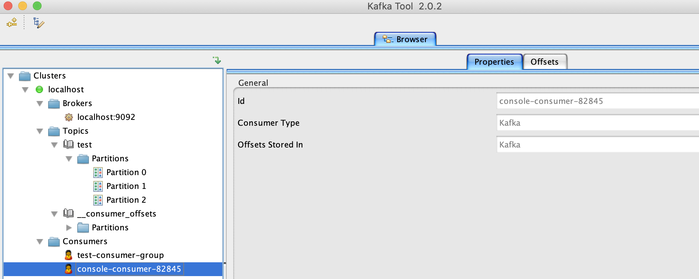
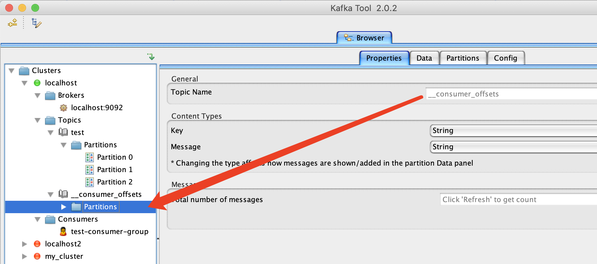
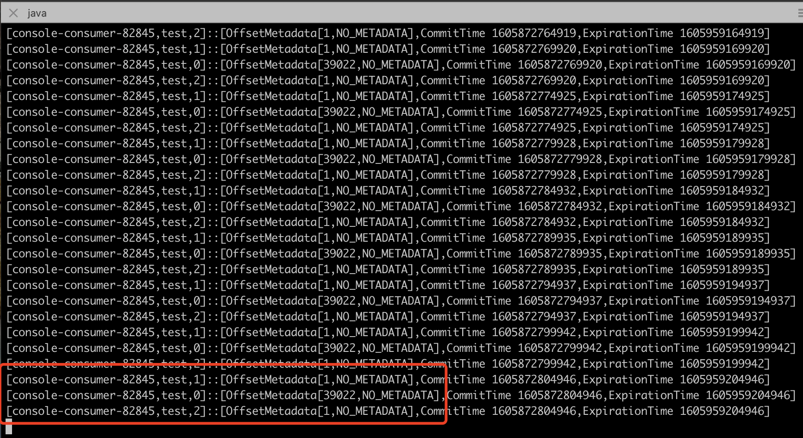
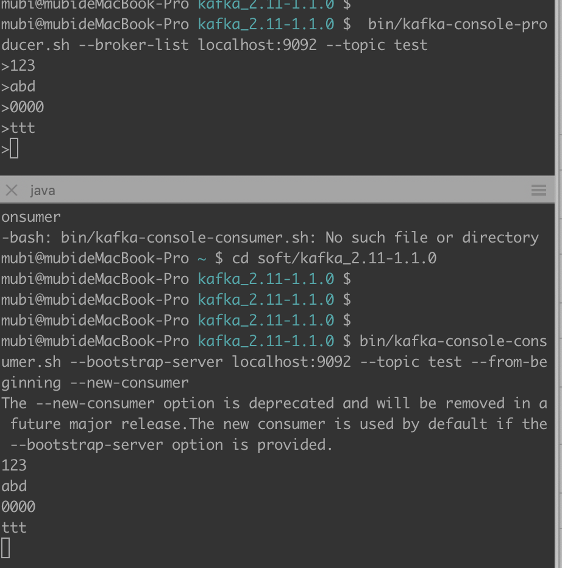
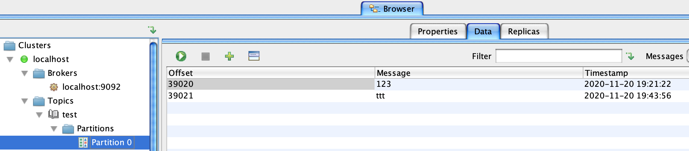
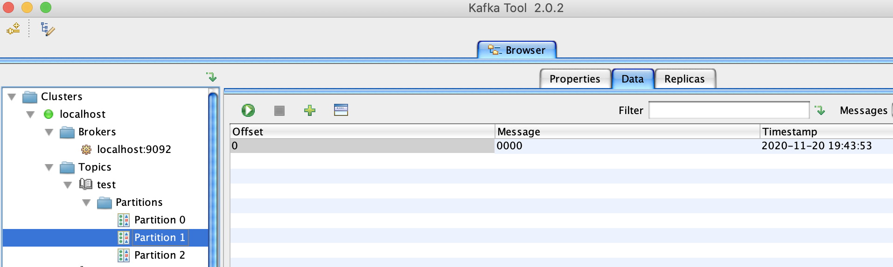
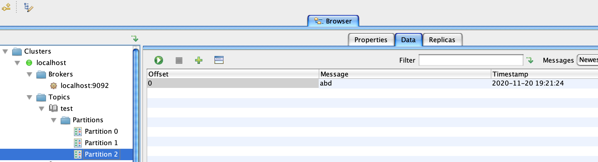

# __consumer_offsets

查看`__consumer_offsets`topic内容

---

启动kafka，并创建topic，生产者，消费者

```java
// zk
bin/zkServer.sh start conf/zoo_local.cfg

// kafka broker
bin/kafka-server-start.sh config/server.properties


// 创建3分区的topic
bin/kafka-topics.sh --zookeeper localhost:2181 --create --topic test --replication-factor 1 --partitions 3


// 控制台生产者
bin/kafka-console-producer.sh --broker-list localhost:9092 --topic test

// 控制台消费者
bin/kafka-console-consumer.sh --bootstrap-server localhost:9092 --topic test --from-beginning --new-consumer


// 获取consumer group的group id(后面需要根据该id查询它的位移信息)
bin/kafka-consumer-groups.sh --bootstrap-server localhost:9092 --list --new-consumer
// 会返回一个消费组id，标记这个消费组，eg：console-consumer-82845
```

通过`kafka-tool`工具查看的一些情况

消费组



`__consumer_offsets` topic(可以看到这个topic有50个partition)



通过groupid得到消费组的便宜信息落到`__consumer_offsets`的哪个topic

`Math.abs("console-consumer-82845".hashCode()) % 50 = 8`， 则可以查看`__consumer_offsets`的8分区

通过如下命令查看，log内容形式:`[Group, Topic, Partition]::[OffsetMetadata[Offset, Metadata], CommitTime, ExpirationTime]`

```java
bin/kafka-simple-consumer-shell.sh --topic __consumer_offsets --partition 8 --broker-list localhost:9092 --formatter "kafka.coordinator.group.GroupMetadataManager\$OffsetsMessageFormatter"
```



---

确认消费偏移量



`test`topic各partition的情况







而根据log,确实是：`partition 0: 39022`，`partition 1: 1`，`partition 2: 1`

```java
[console-consumer-82845,test,1]::[OffsetMetadata[1,NO_METADATA],CommitTime 1605872704862,ExpirationTime 1605959104862]
[console-consumer-82845,test,0]::[OffsetMetadata[39022,NO_METADATA],CommitTime 1605872704862,ExpirationTime 1605959104862]
[console-consumer-82845,test,2]::[OffsetMetadata[1,NO_METADATA],CommitTime 1605872704862,ExpirationTime 1605959104862]
```

`__consumer_offsets`的每条消息的内容：

key=`group.id,topic,partition`
value=`offset,metadata,timestamp`
