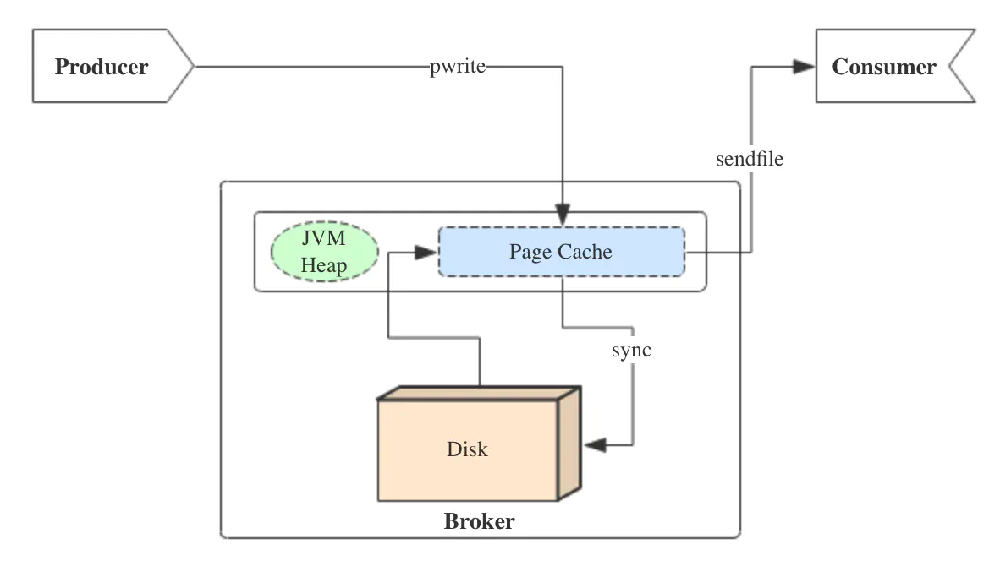
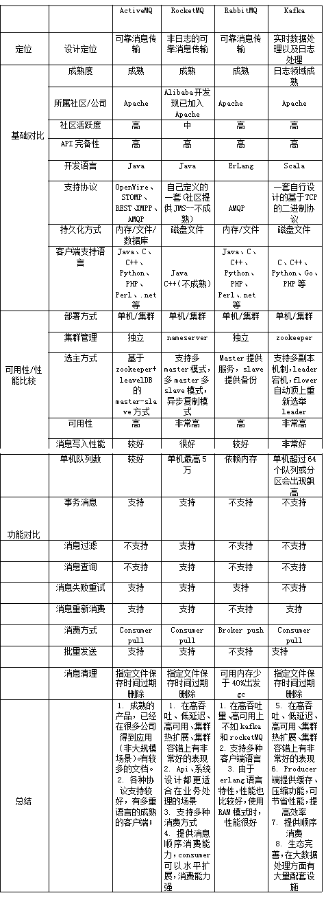

# Kafka面试题

## kafka为什么很快？

### 顺序写入日志

追加数据到日志文件尾部，顺序IO

### 零拷贝 mmap

即便是顺序写入硬盘，硬盘的访问速度还是不可能追上内存。所以Kafka的数据并不是实时的写入硬盘，它充分利用了现代操作系统 分页存储 来利用内存提高I/O效率。

Memory Mapped Files(后面简称mmap)也被翻译成 内存映射文件 ，在64位操作系统中一般可以表示20G的数据文件，它的工作原理是直接利用操作系统的Page来实现文件到物理内存的直接映射。完成映射之后你对物理内存的操作会被同步到硬盘上（操作系统在适当的时候）。

通过mmap，进程像读写硬盘一样读写内存（当然是虚拟机内存），也不必关心内存的大小有虚拟内存为我们兜底。

使用这种方式可以获取很大的I/O提升， 省去了用户空间到内核空间 复制的开销（调用文件的read会把数据先放到内核空间的内存中，然后再复制到用户空间的内存中。）也有一个很明显的缺陷——不可靠， 写到mmap中的数据并没有被真正的写到硬盘，操作系统会在程序主动调用flush的时候才把数据真正的写到硬盘。 Kafka提供了一个参数——producer.type来控制是不是主动flush，如果Kafka写入到mmap之后就立即flush然后再返回Producer叫 同步 (sync)；写入mmap之后立即返回Producer不调用flush叫 异步 (async)。

在内核版本2.1中，引入了sendfile系统调用，以简化网络上和两个本地文件之间的数据传输。 sendfile的引入不仅减少了数据复制，还减少了上下文切换。

`sendfile(socket, file, len);`,运行流程如下：
* sendfile系统调用，文件数据被copy至内核缓冲区
* 再从内核缓冲区copy至内核中socket相关的缓冲区
* 最后再socket相关的缓冲区copy到协议引擎

相较传统read/write方式，2.1版本内核引进的sendfile已经减少了内核缓冲区到user缓冲区，再由user缓冲区到socket相关缓冲区的文件copy，而在内核版本2.4之后，文件描述符结果被改变，sendfile实现了更简单的方式，再次减少了一次copy操作。

在apache，nginx，lighttpd等web服务器当中，都有一项sendfile相关的配置，使用sendfile可以大幅提升文件传输性能。

Kafka把所有的消息都存放在一个一个的文件中，当消费者需要数据的时候Kafka直接把文件发送给消费者，配合mmap作为文件读写方式，直接把它传给sendfile。

### 预读数据/批处理(读一块然后处理)

### 日志分段(有类似跳表索引)

### 数据压缩

当启用压缩时，对批处理的影响特别明显，因为随着数据大小的增加，压缩通常会变得更有效

特别是在使用基于文本的格式时，比如 JSON，压缩的效果会非常明显，压缩比通常在`5x`到`7x`之间

此外，记录的批处理主要作为一个客户端操作，负载在传递的过程中，不仅对网络带宽有积极影响，而且对服务端的磁盘 I/O 利用率也有积极影响

## kafka使用`page cache`

```java
~ free -m
             total       used       free     shared    buffers     cached
Mem:        128956      96440      32515          0       5368      39900
-/+ buffers/cache:      51172      77784
Swap:        16002          0      16001
```

page cache用于缓存文件的页数据，buffer cache用于缓存块设备（如磁盘）的块数据。页是逻辑上的概念，因此page cache是与文件系统同级的；块是物理上的概念，因此buffer cache是与块设备驱动程序同级的。



producer生产消息时，会使用pwrite()系统调用【对应到Java NIO中是FileChannel.write() API】按偏移量写入数据，并且都会先写入page cache里。consumer消费消息时，会使用sendfile()系统调用【对应FileChannel.transferTo() API】，零拷贝地将数据从page cache传输到broker的Socket buffer，再通过网络传输。

同时，page cache中的数据会随着内核中flusher线程的调度以及对sync()/fsync()的调用写回到磁盘，就算进程崩溃，也不用担心数据丢失。另外，如果consumer要消费的消息不在page cache里，才会去磁盘读取，并且会顺便预读出一些相邻的块放入page cache，以方便下一次读取。

**如果Kafka producer的生产速率与consumer的消费速率相差不大，那么就能几乎只靠对broker page cache的读写完成整个生产-消费过程，磁盘访问非常少**。这个结论俗称为"读写空中接力"。并且Kafka持久化消息到各个topic的partition文件时，是只追加的顺序写，充分利用了磁盘顺序访问快的特性，效率高

<a href='https://tech.meituan.com/2015/01/13/kafka-fs-design-theory.html'>美团：Kafka文件存储机制那些事</a>

作者：LittleMagic
链接：https://www.jianshu.com/p/92f33aa0ff52
来源：简书
著作权归作者所有。商业转载请联系作者获得授权，非商业转载请注明出处。

## 消费者提交消费位移时提交的是当前消费到的最新消息的offset还是offset+1？

offset+1

## Kafka中是怎么体现消息顺序性的？如何保证数据的一致性?

每个分区内，每条消息都有一个offset，故只能保证分区内有序

---

HW，LEO维护


副本为3，副本0位leader，副本1和2位follower，在ISR列表里面副本0已经写入了message4，但是consumer只能读取message2，这是因为所有副本都同步了message2，只有High water mark以上的message才能被consumer读取，而High water mark取决于ISR列表里偏移量最小的分区，对应上图中的副本2

所以在message还没有被follower同步完成时会被认为是"不安全的"，如果consumer读取了副本0中的message4，这时候leader挂了，选举了副本1为新的leader，别的消费者去消费的时候就没有message4，就会造成不同的consumer消费的数据不一致，破坏了数据的一致性。

在引入了High water mark机制后，会导致broker之间的消息复制因为某些原因变慢，消息到达消费者的时间也会延长(需要等消息复制完了才能消费)，延迟的时间可以通过参数来设置：replica.lag.time.max.ms(它指定了副本在复制消息时可被允许的最大延迟时间)

## 如何保证数据不会丢失或者重复消费的情况？做过哪些预防措施，增么解决以上问题的

发送：
* 同步发送数据
* ACK = -1（all）

消费：（再平衡）
* 自己维护offset，避免重复消费（低级API）

## Topic 分区副本, 可靠性保证？

保证单个副本中的顺序性

Kafka 的分区多副本架构是 Kafka 可靠性保证的核心，把消息写入多个副本可以使 Kafka 在发生崩溃时仍能保证消息的持久性。

* 同步复制： 只有所有的follower把数据拿过去后才commit，一致性好，可用性不高。
* 异步复制： 只要leader拿到数据立即commit，等follower慢慢去复制，可用性高，立即返回，一致性差一些。
Commit：是指leader告诉客户端，这条数据写成功了。kafka尽量保证commit后立即leader挂掉，其他flower都有该条数据。

kafka不是完全同步，也不是完全异步，是一种ISR机制：

1. leader会维护一个与其基本保持同步的Replica列表，该列表称为ISR(in-sync Replica)，每个Partition都会有一个ISR，而且是由leader动态维护
2. 如果一个flower比一个leader落后太多，或者超过一定时间未发起数据复制请求，则leader将其重ISR中移除
3. 当ISR中所有Replica都向Leader发送ACK时，leader才commit

## kafka重复消费的根本原因就是"数据消费了，但是offset没更新"！而我们要探究一般什么情况下会导致offset没更新？

* 原因1：强行kill线程，导致消费后的数据，offset没有提交（消费系统宕机、重启等)
* 原因2：设置offset为自动提交，关闭kafka时，如果在close之前，调用 consumer.unsubscribe() 则有可能部分offset没提交，下次重启会重复消费
* 原因3:（重复消费最常见的原因）：消费后的数据，当offset还没有提交时，partition就断开连接。比如，通常会遇到消费的数据，处理很耗时，导致超过了Kafka的session timeout时间（0.10.x版本默认是30秒），那么就会re-blance重平衡，此时有一定几率offset没提交，会导致重平衡后重复消费
* 原因4：当消费者重新分配partition的时候，可能出现从头开始消费的情况，导致重发问题。
* 原因5：当消费者消费的速度很慢的时候，可能在一个session周期内还未完成，导致心跳机制检测报告出问题。
* 原因6：并发很大，可能在规定的时间（session.time.out默认30s）内没有消费完，就会可能导致rebalance重平衡，导致一部分offset自动提交失败，然后重平衡后重复消费

## 为了避免磁盘被占满，kafka会周期性的删除陈旧的消息，删除策略是什么?

* 一种是根据消息保留的时间
* 一种是根据topic存储的数据大小

## kafka集群多Topic性能下降

参考：<a href='https://www.cnblogs.com/felixzh/p/6198221.html'>Kafka vs RocketMQ——多Topic对性能稳定性的影响-转自阿里中间件</a>

## 死信队列（Dead-Letter Queue）

当一条消息初次消费失败，消息队列 MQ 会自动进行消息重试；达到最大重试次数后，若消费依然失败，则表明消费者在正常情况下无法正确地消费该消息，此时，消息队列 MQ 不会立刻将消息丢弃，而是将其发送到该消费者对应的特殊队列中，这种正常情况下无法被消费的消息称为死信消息（Dead-Letter Message），存储死信消息的特殊队列称为死信队列（Dead-Letter Queue）

与此对应的还有一个“回退队列”的概念，试想如果消费者在消费时发生了异常，那么就不会对这一次消费进行确认（Ack）,进而发生回滚消息的操作之后消息始终会放在队列的顶部，然后不断被处理和回滚，导致队列陷入死循环。为了解决这个问题，可以为每个队列设置一个回退队列，它和死信队列都是为异常的处理提供的一种机制保障。实际情况下，回退队列的角色可以由死信队列和重试队列来扮演

**重试队列**其实可以看成是一种回退队列，具体指消费端消费消息失败时，为防止消息无故丢失而重新将消息回滚到Broker中。与回退队列不同的是重试队列一般分成多个重试等级，每个重试等级一般也会设置重新投递延时，重试次数越多投递延时就越大

eg: 消息第一次消费失败入重试队列Q1，Q1的重新投递延迟为5s，在5s过后重新投递该消息；如果消息再次消费失败则入重试队列Q2，Q2的重新投递延迟为10s，在10s过后再次投递该消息。以此类推，重试越多次重新投递的时间就越久，为此需要设置一个上限，超过投递次数就入死信队列。重试队列与延迟队列有相同的地方，都是需要设置延迟级别，它们彼此的区别是：延迟队列动作由内部触发，重试队列动作由外部消费端触发；延迟队列作用一次，而重试队列的作用范围会向后传递

注意：**Kafka不支持重试机制也就不支持消息重试，也不支持死信队列**，因此使用kafka做消息队列时，如果遇到了消息在业务处理时出现异常的场景时，需要额外实现消息重试的功能。

## 消息中间件对比（旧）



## 2.数据传输的事物定义有哪三种？

数据传输的事务定义通常有以下三种级别：

1. 至多一次: 消息不会被重复发送，最多被传输一次，但也有可能一次不传输
2. 最少一次: 消息不会被漏发送，最少被传输一次，但也有可能被重复传输.
3. 精确的一次（Exactly once）: 不会漏传输也不会重复传输,每个消息都传输被一次而且仅仅被传输一次，这是大家所期望的
