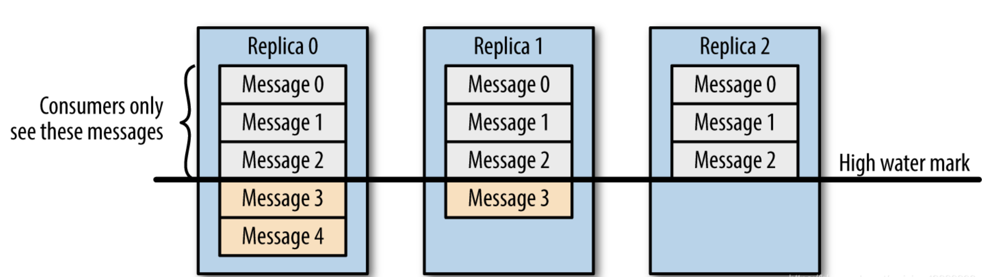

# Kafka 可靠性/数据一致性

## Producer 往 Broker 发送消息（确认机制&同步异步）

kafka 有 Topic 分区副本， Kafka 在 Producer 里面提供了消息确认机制。也就是说我们可以通过配置来决定有几个副本收到这条消息才算消息发送成功。可以在定义 Producer 时通过 acks 参数指定（在 0.8.2.X 版本之前是通过 request.required.acks 参数设置的）

* acks=0：生产者不会等待任何来自服务器的响应。

如果当中出现问题，导致服务器没有收到消息，那么生产者无从得知，会造成消息丢失

由于生产者不需要等待服务器的响应所以可以以网络能够支持的最大速度发送消息，从而达到很高的吞吐量

* acks=1（默认值）：只要集群的Leader节点收到消息，生产者就会收到一个来自服务器的成功响应

如果消息无法到达Leader节点（例如Leader节点崩溃，新的Leader节点还没有被选举出来）生产者就会收到一个错误响应，为了避免数据丢失，生产者会重发消息

如果一个没有收到消息的节点成为新Leader，消息还是会丢失

此时的吞吐量主要取决于使用的是同步发送还是异步发送，吞吐量还受到发送中消息数量的限制，例如生产者在收到服务器响应之前可以发送多少个消息

* acks=-1：只有当所有参与复制的节点全部都收到消息时，生产者才会收到一个来自服务器的成功响应

这种模式是最安全的，可以保证不止一个服务器收到消息，就算有服务器发生崩溃，整个集群依然可以运行

---

另外，Producer 发送消息还可以选择同步（默认，通过 producer.type=sync 配置） 或者异步（producer.type=async）模式。如果设置成异步，虽然会极大的提高消息发送的性能，但是这样会增加丢失数据的风险。如果需要确保消息的可靠性，必须将 producer.type 设置为 sync。

## Topic 分区副本

保证单个副本中的顺序性

Kafka 的分区多副本架构是 Kafka 可靠性保证的核心，把消息写入多个副本可以使 Kafka 在发生崩溃时仍能保证消息的持久性。

* 同步复制： 只有所有的follower把数据拿过去后才commit，一致性好，可用性不高。
* 异步复制： 只要leader拿到数据立即commit，等follower慢慢去复制，可用性高，立即返回，一致性差一些。
Commit：是指leader告诉客户端，这条数据写成功了。kafka尽量保证commit后立即leader挂掉，其他flower都有该条数据。

kafka不是完全同步，也不是完全异步，是一种ISR机制：

1. leader会维护一个与其基本保持同步的Replica列表，该列表称为ISR(in-sync Replica)，每个Partition都会有一个ISR，而且是由leader动态维护
2. 如果一个flower比一个leader落后太多，或者超过一定时间未发起数据复制请求，则leader将其重ISR中移除
3. 当ISR中所有Replica都向Leader发送ACK时，leader才commit

### Leader 选举

Leader 挂掉了，而且 unclean.leader.election.enable=false 的情况下，Kafka 会从 ISR 列表中选择第一个 follower 作为新的 Leader，因为这个分区拥有最新的已经 committed 的消息。通过这个可以保证已经 committed 的消息的数据可靠性。

综上所述，为了保证数据的可靠性，我们最少需要配置一下几个参数：

* producer 级别：acks=all（或者 request.required.acks=-1），同时发生模式为同步 producer.type=sync
* topic 级别：设置 replication.factor>=3，并且 min.insync.replicas>=2；
* broker 级别：关闭不完全的 Leader 选举，即 unclean.leader.election.enable=false；

### 数据一致性

HW维护

副本为3，副本0位leader，副本1和2位follower，在ISR列表里面副本0已经写入了message4，但是consumer只能读取message2，这是因为所有副本都同步了message2，只有High water mark以上的message才能被consumer读取，而High water mark取决于ISR列表里偏移量最小的分区，对应上图中的副本2

所以在message还没有被follower同步完成时会被认为是"不安全的"，如果consumer读取了副本0中的message4，这时候leader挂了，选举了副本1为新的leader，别的消费者去消费的时候就没有message4，就会造成不同的consumer消费的数据不一致，破坏了数据的一致性。

在引入了High water mark机制后，会导致broker之间的消息复制因为某些原因变慢，消息到达消费者的时间也会延长(需要等消息复制完了才能消费)，延迟的时间可以通过参数来设置：replica.lag.time.max.ms(它指定了副本在复制消息时可被允许的最大延迟时间)
