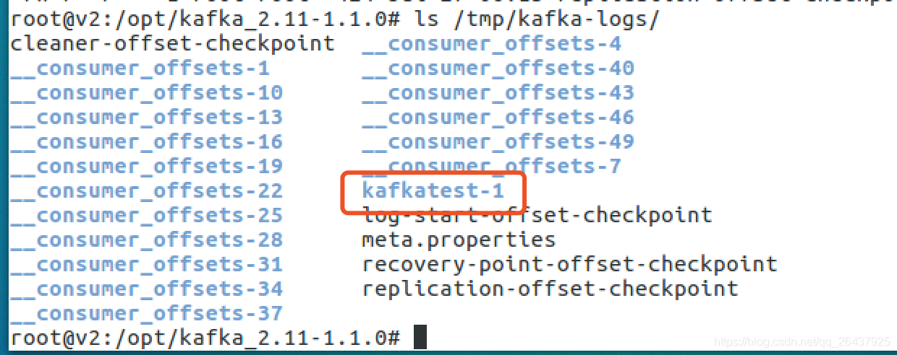
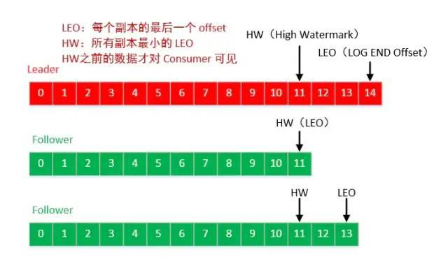

# Producer

## topic的创建和数据生成和落磁盘文件

* 创建topic名称为：`kafkatest`


* 三台broker(0,1,2), 设置topic的partition数目是2，replication备份因子是2
    1. 对于partition 0，leader 是 3，follower 是 1，两个备份
    2. 对于partition 1，leader 是 1，follower 是 2，两个备份
    


一次发送了4条消息，内容分别是

```java
空
a1
b1
c1
```

## 消息路由到不同的partition

* `空`和`b1`存储到了`partition 0`中
* `a1`和`c1`存储到了`partition 1`中


### 查看磁盘上的`kafka-logs`文件目录下对应的topic文件

1. 对于partition 0，leader 是 3，follower 是 1
2. 对于partition 1，leader 是 1，follower 是 2

登录到三台机器分别查看

* broker 1

包含了`kafkatest-0`和`kafkatest-1`两个目录文件


* broker 2

只包含`kafkatest-1`两个目录文件



* broker 3

只包含`kafkatest-0`两个目录文件


### topic分partition的原因与实现

#### 分区的原因

1. 方便在集群中扩展，每个Partition可以通过调整以适应它所在的机器，而一个topic又可以有多个Partition组成，因此整个集群就可以适应任意大小的数据了
2. 可以提高并发，因为可以以Partition为单位读写了

#### 生产者发送进行分区的原则？

我们需要将producer发送的数据封装成一个ProducerRecord对象，然后发送

1. 指明 partition 的情况下，直接将指明的值直接作为要发送的 partiton 值；
2. 没有指明 partition 值但有 key 的情况下，将 key 的 hash 值与topic的partition总数进行取余得到一个 partition 值；
3. 既没有 partition 值又没有 key 值的情况下，第一次调用时随机生成一个整数（后面每次调用在这个整数上自增），将这个值与 topic 可用的 partition 总数**取余**得到 partition 值，也就是常说的 round-robin 算法（轮询）。

### Producer如何将消息可靠的发送给Kafka集群

#### ack应答机制（3种策略）

acks指定了必须有多少个分区副本接收到了消息，生产者才会认为消息是发送成功的。

1. acks=0，生产者成功写入消息之前不会等待来自任何服务器的响应，这种配置，提高吞吐量，但是消息存在丢失风险。
2. acks=1，只要集群的leader（master）收到了消息，生产者将会受到发送成功的一个响应，如果消息无撞到达首领节点（比如首领节点崩溃，新的首领还没有被选举出来），生产者会收到一个错误响应，为了避免数据丢失，生产者会重发消息。不过，如果一个没有收到消息的节点成为新首领，消息还是会丢失。这个时候的吞吐量取决于使用的是同步发送还是异步发送。如果让发送客户端等待服务器的响应（通过调用Future 对象的get（）方法，显然会增加延迟（在网络上传输一个来回的延迟）。如果客户端使用回调，延迟问题就可以得到缓解，不过吞吐量还是会受发送中消息数量的限制（比如，生产者在收到服务器响应之前可以发送多少个消息）。
3. acks=-1，所有参与复制的节点全部收到消息的时候，生产者才会收到来自服务器的一个响应，这种模式最安全，但是吞吐量受限制，它可以保证不止一个服务器收到消息，就算某台服务器奔溃，那么整个集群还是会正产运转。

#### retries

生产者从服务器收到的错误消息有可能是临时的，当生产者收到服务器发来的错误消息，会启动重试机制，当重试了n（设置的值）次，还是收到错误消息，那么将会返回错误。生产者会在每次重试之间间隔100ms，不过可以通过`retry.backoff.ms`改变这个间隔。

#### batch.size

当多个消息发往同一个分区，生产者会将他们放进同一个批次，该参数指定了一个批次可以使用的内存大小，按照字节数进行计算(不是消息个数)；当批次被填满，批次里面所有得消息将会被发送；半满的批次，甚至只包含一个消息也可能会被发送，所以即使把批次设置的很大，也不会造成延迟，只是占用的内存打了一些而已。但是设置的太小，那么生产者将会频繁的发送小，增加一些额外的开销。

#### linger.ms

该参数指定了生产者在发送批次之前等待更多消息加入批次的时间。KafkaProducer会在批次填满或linger.ms达到上限时把批次发送出去。默认情况下，只要有可用的线程， 生产者就会把消息发送出去，就算批次里只有一个消息。把linger.ms设置成比0大的数，让生产者在发送批次之前等待一会儿，使更多的消息加入到这个批次。虽然这样会增加延迟，但也会提升吞吐量（因为一次性发送更多的消息，每个消息的开销就变小了）

#### requests.timeout.ms

生产者发送数据时等待服务器返回响应的时间

#### max.in.flight.requests.per.connection

指定了生产者收到服务器响应之前可以发送多少个消息。它的值越高，将会消耗更多的内存，不过也会提升吞吐量。设置为1，可以保证消息是按照发送的顺序写入服务器。即使发生了重试。

### ISR 机制 和 数据一致性

Leader维护了一个动态的in-sync replica set (ISR)，意为和leader保持同步的follower集合。当ISR中的follower完成数据的同步之后，leader就会给follower发送ack。如果follower长时间未向leader同步数据，则该follower将被踢出ISR，该时间阈值由replica.lag.time.max.ms参数设定。Leader发生故障之后，就会从ISR中选举新的leader

<font color='red'>Kafka 的复制机制既不是完全的同步复制，也不是单纯的异步复制</font>。完全同步复制要求所有能工作的 Follower 都复制完，这条消息才会被认为 commit，这种复制方式极大的影响了吞吐率（高吞吐率是 Kafka 非常重要的一个特性）。而异步复制方式下，Follower 异步的从 Leader 复制数据，数据只要被 Leader 写入 log 就被认为已经 commit，这种情况下如果 Follower 都复制完都落后于 Leader，而如果 Leader 突然宕机，则会丢失数据。

#### LEO & HW 保证副本的数据一致性

* LEO：指的是每个副本最大的offset
* HW：指的是消费者能见到的最大的offset，ISR队列中最小的LEO




#### follower故障

follower发生故障后会被临时踢出ISR，待该follower恢复后，follower会读取本地磁盘记录的上次的HW，并将log文件高于HW的部分截取掉，从HW开始向leader进行同步。等该follower的LEO大于等于该Partition的HW，即follower追上leader之后，就可以重新加入ISR了。

#### leader故障

leader发生故障之后，会从ISR中选出一个新的leader；之后，为保证多个副本之间的数据一致性，其余的follower会先将各自的log文件高于HW的部分截掉，然后从新的leader同步数据。

注意：这只能保证副本之间的数据一致性，并不能保证数据不丢失或者不重复

### 0.11版本之后 幂等 & Exactly Once 语义

对于某些比较重要的消息，我们需要保证exactly once语义，即保证每条消息被发送且仅被发送一次。

在0.11版本之后，Kafka Producer引入了幂等性机制（`idempotent` n. 幂等性），配合acks = -1时的at least once语义，实现了producer到broker的exactly once语义。

`idempotent + at least once = exactly once`

使用时，只需将`enable.idempotence`属性设置为true（kafka会自动将`acks`属性设为-1）

#### 事务应用场景

kafka的应用场景经常是应用先消费一个topic，然后做处理再发到另一个topic，这个`consume-transform-produce`过程需要放到一个事务里面，比如在消息处理或者发送的过程中如果失败了，消费位点也不能提交。

#### 事务处理

producer提供了`initTransactions`, `beginTransaction`, `sendOffsets`, `commitTransaction`, `abortTransaction` 五个事务方法。

```java
import org.apache.kafka.clients.consumer.ConsumerRecord;
import org.apache.kafka.clients.consumer.ConsumerRecords;
import org.apache.kafka.clients.consumer.KafkaConsumer;
import org.apache.kafka.clients.consumer.OffsetAndMetadata;
import org.apache.kafka.clients.producer.KafkaProducer;
import org.apache.kafka.clients.producer.ProducerRecord;
import org.apache.kafka.clients.producer.RecordMetadata;
import org.apache.kafka.common.TopicPartition;

import java.util.Arrays;
import java.util.HashMap;
import java.util.Map;
import java.util.Properties;
import java.util.concurrent.Future;

public class consumeTransformProduce {
    private static Properties getProducerProps(){
        Properties props =  new Properties();
        props.put("bootstrap.servers", "47.52.199.51:9092");
        props.put("retries", 3); // 重试次数
        props.put("batch.size", 100); // 批量发送大小
        props.put("buffer.memory", 33554432); // 缓存大小，根据本机内存大小配置
        props.put("linger.ms", 1000); // 发送频率，满足任务一个条件发送
        props.put("client.id", "producer-syn-2"); // 发送端id,便于统计
        props.put("key.serializer", "org.apache.kafka.common.serialization.StringSerializer");
        props.put("value.serializer", "org.apache.kafka.common.serialization.StringSerializer");
        props.put("transactional.id","producer-2"); // 设置事务Id,每台机器唯一
        props.put("enable.idempotence",true); // 设置幂等性
        return props;
    }

    private static Properties getConsumerProps(){
        Properties props =  new Properties();
        props.put("bootstrap.servers", "47.52.199.51:9092");
        props.put("group.id", "test_3");
        props.put("session.timeout.ms", 30000);       // 如果其超时，将会可能触发rebalance并认为已经死去，重新选举Leader
        props.put("enable.auto.commit", "false");      // 开启自动提交
        props.put("auto.commit.interval.ms", "1000"); // 自动提交时间
        props.put("auto.offset.reset","earliest"); // 从最早的offset开始拉取，latest:从最近的offset开始消费
        props.put("client.id", "producer-syn-1"); // 发送端id,便于统计
        props.put("max.poll.records","100"); // 每次批量拉取条数
        props.put("max.poll.interval.ms","1000");
        props.put("key.deserializer", "org.apache.kafka.common.serialization.StringDeserializer");
        props.put("value.deserializer", "org.apache.kafka.common.serialization.StringDeserializer");
        props.put("isolation.level","read_committed"); // 设置隔离级别
        return props;
    }
    public static void main(String[] args) {
        // 创建生产者
        KafkaProducer<String, String> producer = new KafkaProducer<>(getProducerProps());
        // 创建消费者
        KafkaConsumer<String, String> consumer = new KafkaConsumer<>(getConsumerProps());
        // 初始化事务
        producer.initTransactions();
        // 订阅主题
        consumer.subscribe(Arrays.asList("consumer-tran"));
        for(;;){
            // 开启事务
            producer.beginTransaction();
            // 接受消息
            ConsumerRecords<String, String> records = consumer.poll(500);
            // 处理逻辑
            try {
                Map<TopicPartition, OffsetAndMetadata> commits = new HashMap<>();
                for(ConsumerRecord record : records){
                    // 处理消息
                    System.out.printf("offset = %d, key = %s, value = %s\n", record.offset(), record.key(), record.value());
                    // 记录提交的偏移量
                    commits.put(new TopicPartition(record.topic(), record.partition()),new OffsetAndMetadata(record.offset()));
                    // 产生新消息
                    Future<RecordMetadata> metadataFuture = producer.send(new ProducerRecord<>("consumer-send",record.value()+"send"));
                }
                // 提交偏移量
                producer.sendOffsetsToTransaction(commits,"group0323");
                // 事务提交
                producer.commitTransaction();

            }catch (Exception e){
                e.printStackTrace();
                producer.abortTransaction();
            }
        }
    }
}
```

## KafkaProducer源码

### KafkaProducer 交互简图


所以重点要关心：1. 元数据，2. 数据如何发送

同步发送如下图：


### 源码流程图


```java
KafkaProducer
	send
		doSend(ProducerRecord<K, V> record, Callback callback)
			waitOnMetadata() （集群和topic元信息）
			serialize（serializedKey, serializedValue构造）
			partition() (获取一个分区号)
			new TopicPartition
			ensureValidRecordSize() 校验record的size
			timestamp
			Callback
			accumulator.append()
				RecordAccumulator
					private final ConcurrentMap<TopicPartition, Deque<ProducerBatch>> batches;
					 tryAppend(timestamp, key, value, headers, callback, dq);
			this.sender.wakeup();
				 sender thread run()
					long pollTimeout = sendProducerData(now);
						 this.accumulator.drain()
						this.accumulator.expiredBatches
						sendProduceRequests(batches, now);
							ClientRequest
							client.send(clientRequest, now);
					client.poll(pollTimeout, now);
						NetworkClient poll()
							this.selector.poll(Utils.min(timeout, metadataTimeout, requestTimeoutMs));
```


#### 元数据交互

sender从kafka集群获取信息，然后更新Metadata；KafkaProducer先读取Metadata，然后才能确定开始消息写入流程

可以看到Metadata是有多个客户端线程(即KafkaProducer线程)读，一个sender线程更新，因此它必须是线程安全的，查看源码可以看到其所有方法都是加上`synchronized`关键字的

```java
/**
 * A class encapsulating some of the logic around metadata.
 * <p>
 * This class is shared by the client thread (for partitioning) and the background sender thread.
 *
 * Metadata is maintained for only a subset of topics, which can be added to over time. When we request metadata for a
 * topic we don't have any metadata for it will trigger a metadata update.
 * <p>
 * If topic expiry is enabled for the metadata, any topic that has not been used within the expiry interval
 * is removed from the metadata refresh set after an update. Consumers disable topic expiry since they explicitly
 * manage topics while producers rely on topic expiry to limit the refresh set.
 */
public final class Metadata {
    ...
    public synchronized Cluster fetch()
    public synchronized void add(String topic)
    public synchronized long timeToNextUpdate(long nowMs)
    public synchronized int requestUpdate()
    public synchronized boolean updateRequested()
    public synchronized void awaitUpdate(final int lastVersion, final long maxWaitMs)
    ...
}
```

* `org.apache.kafka.clients.producer.KafkaProducer#waitOnMetadata`

```java
/**
 * Wait for cluster metadata including partitions for the given topic to be available.
 * @param topic The topic we want metadata for
 * @param partition A specific partition expected to exist in metadata, or null if there's no preference
 * @param maxWaitMs The maximum time in ms for waiting on the metadata
 * @return The cluster containing topic metadata and the amount of time we waited in ms
 */
private ClusterAndWaitTime waitOnMetadata(String topic, Integer partition, long maxWaitMs) throws InterruptedException {
    /**
     * metadata维护了topic和过期时间的Map结构(即 topic expiry)：Map<String, Long> topics;
     * add 会判断是否命中了Map且时间过期判断并更新，否则要进行Metadata的更新（由sender线程负责更新）
     * 注：add方法在新增topic时候才会`requestUpdateForNewTopics`，更新标记（Metadata的成员属性needUpdate）
     */
    // add topic to metadata topic list if it is not there already and reset expiry
    metadata.add(topic);
    Cluster cluster = metadata.fetch();
    Integer partitionsCount = cluster.partitionCountForTopic(topic);
    // Return cached metadata if we have it, and if the record's partition is either undefined
    // or within the known partition range
    // 指定分区空，或者是小于分区总数的和合理值，就返回
    if (partitionsCount != null && (partition == null || partition < partitionsCount))
        return new ClusterAndWaitTime(cluster, 0);

    long begin = time.milliseconds();
    long remainingWaitMs = maxWaitMs;
    long elapsed;
    // Issue metadata requests until we have metadata for the topic or maxWaitTimeMs is exceeded.
    // In case we already have cached metadata for the topic, but the requested partition is greater
    // than expected, issue an update request only once. This is necessary in case the metadata
    // is stale and the number of partitions for this topic has increased in the meantime.
    do {
        // 需要更新元数据信息，并唤醒 sender 线程，去完成元数据更新
        log.trace("Requesting metadata update for topic {}.", topic);
        metadata.add(topic);
        int version = metadata.requestUpdate();
        sender.wakeup();
        try {
            // 开始更新元数据，否则要抛出 TimeoutException
            metadata.awaitUpdate(version, remainingWaitMs);
        } catch (TimeoutException ex) {
            // Rethrow with original maxWaitMs to prevent logging exception with remainingWaitMs
            throw new TimeoutException("Failed to update metadata after " + maxWaitMs + " ms.");
        }
        cluster = metadata.fetch();
        elapsed = time.milliseconds() - begin;
        if (elapsed >= maxWaitMs)
            throw new TimeoutException("Failed to update metadata after " + maxWaitMs + " ms.");
        if (cluster.unauthorizedTopics().contains(topic))
            throw new TopicAuthorizationException(topic);
        remainingWaitMs = maxWaitMs - elapsed;
        partitionsCount = cluster.partitionCountForTopic(topic);
    } while (partitionsCount == null);

    if (partition != null && partition >= partitionsCount) {
        throw new KafkaException(
                String.format("Invalid partition given with record: %d is not in the range [0...%d).", partition, partitionsCount));
    }

    return new ClusterAndWaitTime(cluster, elapsed);
}
```

元数据部分总结

1. KafkaProducer主线程和sender线程通过wait/notify同步。主线程负责发出更新信号和读取元数据，sender线程负责更新集群元数据
2. 为了避免频繁更新元数据给服务端造成压力，Metadata两次更新时间间隔不能小于refreshBackOffMs设计
3. Metadata使用version来表示元信息的版本，更新后版本就加1，通过比较新旧版本来判断Metadata是否更新完成
4. Metadata不是存放所有topic信息，而是维护使用到的topic的信息

#### 元数据更新重难点

刷新metadata并不仅在第一次初始化时做。为了能适应kafka broker运行中因为各种原因挂掉、partition改变等变化，eventHandler会定期的再去刷新一次该metadata，刷新的间隔用参数topic.metadata.refresh.interval.ms定义，默认值是10分钟


* 调用send, 才会新建SyncProducer，只有调用send才会去定期刷新metadata在每次取metadata时，kafka会新建一个SyncProducer去取metadata，逻辑处理完后再close。

* 根据当前SyncProducer(一个Broker的连接)取得的最新的完整的metadata，刷新ProducerPool中到broker的连接.每10分钟的刷新会直接重新把到每个broker的socket连接重建，意味着在这之后的第一个请求会有几百毫秒的延迟。如果不想要该延迟，把topic.metadata.refresh.interval.ms值改为-1，这样只有在发送失败时，才会重新刷新。

* Kafka的集群中如果某个partition所在的broker挂了，可以检查错误后重启重新加入集群，手动做rebalance，producer的连接会再次断掉，直到rebalance完成，那么刷新后取到的连接着中就会有这个新加入的broker。

#### 序列化

Producer 端会对 record 的 key 和 value 值进行序列化操作，那么显然也会在 Consumer 端再进行相应的反序列化；

Kafka 内部提供提供了序列化和反序列化算法

#### 计算 record 要发送到的 partition？

未指定分区的情况下，默认的分区策略如下：

* 如果指定了partition就用指定的，否则有一个partition方法来计算

```java
/**
 * computes partition for given record.
 * if the record has partition returns the value otherwise
 * calls configured partitioner class to compute the partition.
 */
private int partition(ProducerRecord<K, V> record, byte[] serializedKey, byte[] serializedValue, Cluster cluster) {
    Integer partition = record.partition();
    return partition != null ?
            partition :
            partitioner.partition(
                    record.topic(), record.key(), serializedKey, record.value(), serializedValue, cluster);
}
```

* 没有指明 partition 值, 但有 key 的情况下，将 key 的 hash 值与 topic 的 partition 数进行取余得到 partition 值；
* 没有指明 partition 值, 且没有 key 值的情况下，第一次调用时随机生成一个整数（后面每次调用在这个整数上自增），将这个值与 topic 可用的 partition 总数取余得到 partition 值（即 round-robin 算法）

```java
public int partition(String topic, Object key, byte[] keyBytes, Object value, byte[] valueBytes, Cluster cluster) {
    List<PartitionInfo> partitions = cluster.partitionsForTopic(topic);
    int numPartitions = partitions.size();
    if (keyBytes == null) {// 没有指定 key 的情况下
        int nextValue = nextValue(topic); // 第一次的时候产生一个随机整数,后面每次调用在之前的基础上自增;
        List<PartitionInfo> availablePartitions = cluster.availablePartitionsForTopic(topic);
        // leader 不为 null,即为可用的 partition
        if (availablePartitions.size() > 0) {
            int part = Utils.toPositive(nextValue) % availablePartitions.size();
            return availablePartitions.get(part).partition();
        } else {
            return Utils.toPositive(nextValue) % numPartitions;
        }
    } else {// 有 key 的情况下,使用 key 的 hash 值进行计算
        return Utils.toPositive(Utils.murmur2(keyBytes)) % numPartitions; // 选择 key 的 hash 值
    }
}

// 根据 topic 获取对应的整数变量
private int nextValue(String topic) {
    AtomicInteger counter = topicCounterMap.get(topic);
    if (null == counter) { // 第一次调用时，随机产生
        counter = new AtomicInteger(new Random().nextInt());
        AtomicInteger currentCounter = topicCounterMap.putIfAbsent(topic, counter);
        if (currentCounter != null) {
            counter = currentCounter;
        }
    }
    return counter.getAndIncrement(); // 后面再调用时，根据之前的结果自增
}
```

<font color='red'>当然也可以自己实现`Partitioner`接口</font>

#### accumulator.append()

##### RecordAccumulator

```java
/**
 * This class acts as a queue that accumulates records into {@link MemoryRecords}
 * instances to be sent to the server.
 * <p>
 * The accumulator uses a bounded amount of memory and append calls will block when that memory is exhausted, unless
 * this behavior is explicitly disabled.
 */
public final class RecordAccumulator {

    private final Logger log;
    // RecordAccumulator是否关闭的标志位closed
    private volatile boolean closed;
    // flushes过程计数器flushesInProgress
    private final AtomicInteger flushesInProgress;
    // appends过程计数器appendsInProgress
    private final AtomicInteger appendsInProgress;
    // 批量大小batchSize
    private final int batchSize;
    // 压缩器类型CompressionType实例compression
    private final CompressionType compression;
    // 延迟时间lingerMs
    private final long lingerMs;
    // 重试时间retryBackoffMs
    private final long retryBackoffMs;
    // 缓冲池BufferPool类型的free
    private final BufferPool free;
    private final Time time;
    private final ApiVersions apiVersions;
    // TopicPartition到RecordBatch双端队列的ConcurrentMap集合
    private final ConcurrentMap<TopicPartition, Deque<ProducerBatch>> batches;
    // 处于完成状态的批量记录IncompleteRecordBatches类型的incomplete
    private final IncompleteBatches incomplete;
    // The following variables are only accessed by the sender thread, so we don't need to protect them.
    private final Set<TopicPartition> muted;
    private int drainIndex;
    private final TransactionManager transactionManager;
```


##### append方法的源码流程

```java
/**
 * Add a record to the accumulator, return the append result
 * <p>
 * The append result will contain the future metadata, and flag for whether the appended batch is full or a new batch is created
 * <p>
 *
 * @param tp The topic/partition to which this record is being sent
 * @param timestamp The timestamp of the record
 * @param key The key for the record
 * @param value The value for the record
 * @param headers the Headers for the record
 * @param callback The user-supplied callback to execute when the request is complete
 * @param maxTimeToBlock The maximum time in milliseconds to block for buffer memory to be available
 */
public RecordAppendResult append(TopicPartition tp,
                                 long timestamp,
                                 byte[] key,
                                 byte[] value,
                                 Header[] headers,
                                 Callback callback,
                                 long maxTimeToBlock) throws InterruptedException {
    // We keep track of the number of appending thread to make sure we do not miss batches in
    // abortIncompleteBatches().
    appendsInProgress.incrementAndGet();
    ByteBuffer buffer = null;
    if (headers == null) headers = Record.EMPTY_HEADERS;
    try {
        /**
         * 获取(或创建)对应的deque
         */
        // check if we have an in-progress batch
        Deque<ProducerBatch> dq = getOrCreateDeque(tp);
        synchronized (dq) {
            if (closed)
                throw new IllegalStateException("Cannot send after the producer is closed.");
            /**
             * 尝试往队列添加数据
             *  数据需要添加到`ProducerBatch`中，需要内存;第一次还没有`ProducerBatch`，会失败
             */
            RecordAppendResult appendResult = tryAppend(timestamp, key, value, headers, callback, dq);
            if (appendResult != null)
                return appendResult;
        }

        /**
         * 计算一个`ProducerBatch`的大小，从`BufferPool`线程池中申请,默认的batchSize=16k
         *  如果一个record的大小超过了一个batchSize，那么一个record就是一个`ProducerBatch`,数据一条一条的发送
         */
        // we don't have an in-progress record batch try to allocate a new batch
        byte maxUsableMagic = apiVersions.maxUsableProduceMagic();
        int size = Math.max(this.batchSize, AbstractRecords.estimateSizeInBytesUpperBound(maxUsableMagic, compression, key, value, headers));
        log.trace("Allocating a new {} byte message buffer for topic {} partition {}", size, tp.topic(), tp.partition());
        buffer = free.allocate(size, maxTimeToBlock);
        synchronized (dq) {
            // Need to check if producer is closed again after grabbing the dequeue lock.
            if (closed)
                throw new IllegalStateException("Cannot send after the producer is closed.");
            /**
             * 继续尝试添加到`ProducerBatch`中
             *  第一次申请的内存还没有生成一个`ProducerBatch`,所以append还是会失败
              */
            RecordAppendResult appendResult = tryAppend(timestamp, key, value, headers, callback, dq);
            if (appendResult != null) {
                // Somebody else found us a batch, return the one we waited for! Hopefully this doesn't happen often...
                return appendResult;
            }

            /**
             * 去创建`ProducerBatch`
             */
            MemoryRecordsBuilder recordsBuilder = recordsBuilder(buffer, maxUsableMagic);
            ProducerBatch batch = new ProducerBatch(tp, recordsBuilder, time.milliseconds());
            /**
             * 继续尝试添加到`ProducerBatch`中
             */
            FutureRecordMetadata future = Utils.notNull(batch.tryAppend(timestamp, key, value, headers, callback, time.milliseconds()));

            /**
             * `ProducerBatch`放到deque的尾部
             */
            dq.addLast(batch);
            incomplete.add(batch);

            // Don't deallocate this buffer in the finally block as it's being used in the record batch
            buffer = null;

            return new RecordAppendResult(future, dq.size() > 1 || batch.isFull(), true);
        }
    } finally {
        if (buffer != null)
            free.dea llocate(buffer);
        appendsInProgress.decrementAndGet();
    }
}
```

#### sender线程处理流程


* 注：在`new KafkaProducer<>(props);`的时候会启动sender线程

##### sender源码

```java
Sender 
	run
		sendProducerData
			Cluster cluster = metadata.fetch();
		 	this.accumulator.ready(cluster, now);
			Map<Integer, List<ProducerBatch>> batches = this.accumulator.drain
			sensors.updateProduceRequestMetrics(batches);
			sendProduceRequests(batches, now);
		client.poll(pollTimeout, now);
			metadataUpdater.maybeUpdate(now);
				NetworkClient maybeUpdate()
			this.selector.poll(Utils.min(timeout, metadataTimeout, requestTimeoutMs));
```

##### sendProducerData

```java
private long sendProducerData(long now) {
    /**
     * 获取到当前的集群信息
     */
    Cluster cluster = metadata.fetch();

    /**
     * 获取当前准备发送的partition(每个partition有一个leader broker， 没有则要更新元数据信息)
     *
     * ready方法返回
     * 1. 哪些TopicPartition所对应的Node节点是可以发送信息的。
     * 2. 下次检查节点是否ready的时间。
     * 3. 哪些TopicPartition对应的leader找不到。
     */
    // get the list of partitions with data ready to send
    RecordAccumulator.ReadyCheckResult result = this.accumulator.ready(cluster, now);

    // if there are any partitions whose leaders are not known yet, force metadata update
    if (!result.unknownLeaderTopics.isEmpty()) {
        // The set of topics with unknown leader contains topics with leader election pending as well as
        // topics which may have expired. Add the topic again to metadata to ensure it is included
        // and request metadata update, since there are messages to send to the topic.
        for (String topic : result.unknownLeaderTopics)
            this.metadata.add(topic);
        this.metadata.requestUpdate();
    }

    /**
     * NetworkClient检查broker leader网络连接情况，不符合条件的Node将从readyNodes中移除
     */
    // remove any nodes we aren't ready to send to
    Iterator<Node> iter = result.readyNodes.iterator();
    long notReadyTimeout = Long.MAX_VALUE;
    while (iter.hasNext()) {
        Node node = iter.next();
        if (!this.client.ready(node, now)) {
            iter.remove();
            notReadyTimeout = Math.min(notReadyTimeout, this.client.connectionDelay(node, now));
        }
    }

    /**
     * 上面确定了哪些broker leader是可以发送数据的，调用RecordAccumulator.drain()方法，获取待发送的消息集合
     * 返回<brokerId, ProducerBatch的list集合>的一个map结构，并设置TopicPartition为muted
     */
    // create produce requests
    Map<Integer, List<ProducerBatch>> batches = this.accumulator.drain(cluster, result.readyNodes,
            this.maxRequestSize, now);
    if (guaranteeMessageOrder) {
        // Mute all the partitions drained
        for (List<ProducerBatch> batchList : batches.values()) {
            for (ProducerBatch batch : batchList)
                this.accumulator.mutePartition(batch.topicPartition);
        }
    }

    /**
     * 判断过期的ProducerBatch，再调用failBatch()方法：会调用 ProducerBatch 的done()方法去释放空间
     */
    List<ProducerBatch> expiredBatches = this.accumulator.expiredBatches(this.requestTimeout, now);
    // Reset the producer id if an expired batch has previously been sent to the broker. Also update the metrics
    // for expired batches. see the documentation of @TransactionState.resetProducerId to understand why
    // we need to reset the producer id here.
    if (!expiredBatches.isEmpty())
        log.trace("Expired {} batches in accumulator", expiredBatches.size());
    for (ProducerBatch expiredBatch : expiredBatches) {
        failBatch(expiredBatch, -1, NO_TIMESTAMP, expiredBatch.timeoutException(), false);
        if (transactionManager != null && expiredBatch.inRetry()) {
            // This ensures that no new batches are drained until the current in flight batches are fully resolved.
            transactionManager.markSequenceUnresolved(expiredBatch.topicPartition);
        }
    }

    sensors.updateProduceRequestMetrics(batches);

    // If we have any nodes that are ready to send + have sendable data, poll with 0 timeout so this can immediately
    // loop and try sending more data. Otherwise, the timeout is determined by nodes that have partitions with data
    // that isn't yet sendable (e.g. lingering, backing off). Note that this specifically does not include nodes
    // with sendable data that aren't ready to send since they would cause busy looping.
    long pollTimeout = Math.min(result.nextReadyCheckDelayMs, notReadyTimeout);
    if (!result.readyNodes.isEmpty()) {
        log.trace("Nodes with data ready to send: {}", result.readyNodes);
        // if some partitions are already ready to be sent, the select time would be 0;
        // otherwise if some partition already has some data accumulated but not ready yet,
        // the select time will be the time difference between now and its linger expiry time;
        // otherwise the select time will be the time difference between now and the metadata expiry time;
        pollTimeout = 0;
    }
    /**
     * 会封装成ClientRequest，发送到NetworkClient,再调用NetworkClient.send()将ClientRequest写入KafkaChannel的send字段
     */
    sendProduceRequests(batches, now);

    return pollTimeout;
}
```

##### 超时消息的处理

```java
/**
 * 判断过期的ProducerBatch，再调用failBatch()方法
 *  会调用 ProducerBatch 的done()方法结束request
 *  会调用 accumulator.deallocate 去释放内存
 */
List<ProducerBatch> expiredBatches = this.accumulator.expiredBatches(this.requestTimeout, now);
// Reset the producer id if an expired batch has previously been sent to the broker. Also update the metrics
// for expired batches. see the documentation of @TransactionState.resetProducerId to understand why
// we need to reset the producer id here.
if (!expiredBatches.isEmpty())
    log.trace("Expired {} batches in accumulator", expiredBatches.size());
for (ProducerBatch expiredBatch : expiredBatches) {
    failBatch(expiredBatch, -1, NO_TIMESTAMP, expiredBatch.timeoutException(), false);
    if (transactionManager != null && expiredBatch.inRetry()) {
        // This ensures that no new batches are drained until the current in flight batches are fully resolved.
        transactionManager.markSequenceUnresolved(expiredBatch.topicPartition);
    }
}
```

```java
/**
 * Get a list of batches which have been sitting in the accumulator too long and need to be expired.
 */
public List<ProducerBatch> expiredBatches(int requestTimeout, long now) {
    List<ProducerBatch> expiredBatches = new ArrayList<>();
    for (Map.Entry<TopicPartition, Deque<ProducerBatch>> entry : this.batches.entrySet()) {
        Deque<ProducerBatch> dq = entry.getValue();
        TopicPartition tp = entry.getKey();
        // We only check if the batch should be expired if the partition does not have a batch in flight.
        // This is to prevent later batches from being expired while an earlier batch is still in progress.
        // Note that `muted` is only ever populated if `max.in.flight.request.per.connection=1` so this protection
        // is only active in this case. Otherwise the expiration order is not guaranteed.
        if (!muted.contains(tp)) {
            synchronized (dq) {
                // iterate over the batches and expire them if they have been in the accumulator for more than requestTimeOut
                ProducerBatch lastBatch = dq.peekLast();
                Iterator<ProducerBatch> batchIterator = dq.iterator();
                while (batchIterator.hasNext()) {
                    ProducerBatch batch = batchIterator.next();
                    boolean isFull = batch != lastBatch || batch.isFull();
                    // Check if the batch has expired. Expired batches are closed by maybeExpire, but callbacks
                    // are invoked after completing the iterations, since sends invoked from callbacks
                    // may append more batches to the deque being iterated. The batch is deallocated after
                    // callbacks are invoked.
                    /**
                     * 判断是否超时，并从deque中删除
                     */
                    if (batch.maybeExpire(requestTimeout, retryBackoffMs, now, this.lingerMs, isFull)) {
                        expiredBatches.add(batch);
                        batchIterator.remove();
                    } else {
                        // Stop at the first batch that has not expired.
                        break;
                    }
                }
            }
        }
    }
    return expiredBatches;
}
```

```java
/**
 * A batch whose metadata is not available should be expired if one of the following is true:
 * <ol>
 *     <li> the batch is not in retry AND request timeout has elapsed after it is ready (full or linger.ms has reached).
 *     <li> the batch is in retry AND request timeout has elapsed after the backoff period ended.
 * </ol>
 * This methods closes this batch and sets {@code expiryErrorMessage} if the batch has timed out.
 */
boolean maybeExpire(int requestTimeoutMs, long retryBackoffMs, long now, long lingerMs, boolean isFull) {
    /**
     * requestTimeoutMs 请求发送超时时间，默认 30s
     * now 当前时间
     * this.lastAppendTime ProducerBatch 创建的时间（也即上一次重试的时间）
     * now - this.lastAppendTime 大于 requestTimeoutMs 则说明 当前 ProducerBatch 超时了，还未发送出去
     * lingerMs ProducerBatch最多等待的时间一定要发送出去，默认：100ms
     * retryBackoffMs 重试的时间间隔
     *
     * 没设置重试，并且发送批次（batch.size）满了，并且配置请求超时时间（request.timeout.ms）小于【当前时间减去最后追加批次的时间】
     * 没设置重试，并且 request.timeout.ms 小于【创建批次时间减去配置的等待发送的时间（linger.ms）】
     * 设置重试，并且 request.timeout.ms 小于【当前时间-最后重试时间-重试需要等待的时间（retry.backoff.ms）】
     */
    if (!this.inRetry() && isFull && requestTimeoutMs < (now - this.lastAppendTime))
        expiryErrorMessage = (now - this.lastAppendTime) + " ms has passed since last append";
    else if (!this.inRetry() && requestTimeoutMs < (createdTimeMs(now) - lingerMs))
        expiryErrorMessage = (createdTimeMs(now) - lingerMs) + " ms has passed since batch creation plus linger time";
    else if (this.inRetry() && requestTimeoutMs < (waitedTimeMs(now) - retryBackoffMs))
        expiryErrorMessage = (waitedTimeMs(now) - retryBackoffMs) + " ms has passed since last attempt plus backoff time";

    boolean expired = expiryErrorMessage != null;
    if (expired)
        abortRecordAppends();
    return expired;
}
```

##### client.poll

调用`NetworkClient.poll()`方法，将KafkaChannel.send字段中保存的ClientRequest发送出去，并且还会处理服务端发回的响应、处理超时的请求、调用用户自定义的CallBack

* NetworkClient.poll()

```java
/**
 * Do actual reads and writes to sockets.
 *
 * @param timeout The maximum amount of time to wait (in ms) for responses if there are none immediately,
 *                must be non-negative. The actual timeout will be the minimum of timeout, request timeout and
 *                metadata timeout
 * @param now The current time in milliseconds
 * @return The list of responses received
 */
@Override
public List<ClientResponse> poll(long timeout, long now) {
    if (!abortedSends.isEmpty()) {
        // If there are aborted sends because of unsupported version exceptions or disconnects,
        // handle them immediately without waiting for Selector#poll.
        List<ClientResponse> responses = new ArrayList<>();
        handleAbortedSends(responses);
        completeResponses(responses);
        return responses;
    }

    long metadataTimeout = metadataUpdater.maybeUpdate(now);
    try {
        this.selector.poll(Utils.min(timeout, metadataTimeout, requestTimeoutMs));
    } catch (IOException e) {
        log.error("Unexpected error during I/O", e);
    }

    // process completed actions
    long updatedNow = this.time.milliseconds();
    List<ClientResponse> responses = new ArrayList<>();
    handleCompletedSends(responses, updatedNow);
    handleCompletedReceives(responses, updatedNow);
    handleDisconnections(responses, updatedNow);
    handleConnections();
    handleInitiateApiVersionRequests(updatedNow);
    handleTimedOutRequests(responses, updatedNow);
    completeResponses(responses);

    return responses;
}
```

* selector poll

```java
/**
 * Do whatever I/O can be done on each connection without blocking. This includes completing connections, completing
 * disconnections, initiating new sends, or making progress on in-progress sends or receives.
 *
 * When this call is completed the user can check for completed sends, receives, connections or disconnects using
 * {@link #completedSends()}, {@link #completedReceives()}, {@link #connected()}, {@link #disconnected()}. These
 * lists will be cleared at the beginning of each `poll` call and repopulated by the call if there is
 * any completed I/O.
 *
 * In the "Plaintext" setting, we are using socketChannel to read & write to the network. But for the "SSL" setting,
 * we encrypt the data before we use socketChannel to write data to the network, and decrypt before we return the responses.
 * This requires additional buffers to be maintained as we are reading from network, since the data on the wire is encrypted
 * we won't be able to read exact no.of bytes as kafka protocol requires. We read as many bytes as we can, up to SSLEngine's
 * application buffer size. This means we might be reading additional bytes than the requested size.
 * If there is no further data to read from socketChannel selector won't invoke that channel and we've have additional bytes
 * in the buffer. To overcome this issue we added "stagedReceives" map which contains per-channel deque. When we are
 * reading a channel we read as many responses as we can and store them into "stagedReceives" and pop one response during
 * the poll to add the completedReceives. If there are any active channels in the "stagedReceives" we set "timeout" to 0
 * and pop response and add to the completedReceives.
 *
 * Atmost one entry is added to "completedReceives" for a channel in each poll. This is necessary to guarantee that
 * requests from a channel are processed on the broker in the order they are sent. Since outstanding requests added
 * by SocketServer to the request queue may be processed by different request handler threads, requests on each
 * channel must be processed one-at-a-time to guarantee ordering.
 *
 * @param timeout The amount of time to wait, in milliseconds, which must be non-negative
 * @throws IllegalArgumentException If `timeout` is negative
 * @throws IllegalStateException If a send is given for which we have no existing connection or for which there is
 *         already an in-progress send
 */
@Override
public void poll(long timeout) throws IOException {
    if (timeout < 0)
        throw new IllegalArgumentException("timeout should be >= 0");

    boolean madeReadProgressLastCall = madeReadProgressLastPoll;
    clear();

    boolean dataInBuffers = !keysWithBufferedRead.isEmpty();

    if (hasStagedReceives() || !immediatelyConnectedKeys.isEmpty() || (madeReadProgressLastCall && dataInBuffers))
        timeout = 0;

    if (!memoryPool.isOutOfMemory() && outOfMemory) {
        //we have recovered from memory pressure. unmute any channel not explicitly muted for other reasons
        log.trace("Broker no longer low on memory - unmuting incoming sockets");
        for (KafkaChannel channel : channels.values()) {
            if (channel.isInMutableState() && !explicitlyMutedChannels.contains(channel)) {
                channel.unmute();
            }
        }
        outOfMemory = false;
    }

    /* check ready keys */
    long startSelect = time.nanoseconds();
    int numReadyKeys = select(timeout);
    long endSelect = time.nanoseconds();
    this.sensors.selectTime.record(endSelect - startSelect, time.milliseconds());

    if (numReadyKeys > 0 || !immediatelyConnectedKeys.isEmpty() || dataInBuffers) {
        Set<SelectionKey> readyKeys = this.nioSelector.selectedKeys();

        // Poll from channels that have buffered data (but nothing more from the underlying socket)
        if (dataInBuffers) {
            keysWithBufferedRead.removeAll(readyKeys); //so no channel gets polled twice
            Set<SelectionKey> toPoll = keysWithBufferedRead;
            keysWithBufferedRead = new HashSet<>(); //poll() calls will repopulate if needed
            pollSelectionKeys(toPoll, false, endSelect);
        }

        // Poll from channels where the underlying socket has more data
        pollSelectionKeys(readyKeys, false, endSelect);
        // Clear all selected keys so that they are included in the ready count for the next select
        readyKeys.clear();

        pollSelectionKeys(immediatelyConnectedKeys, true, endSelect);
        immediatelyConnectedKeys.clear();
    } else {
        madeReadProgressLastPoll = true; //no work is also "progress"
    }

    long endIo = time.nanoseconds();
    this.sensors.ioTime.record(endIo - endSelect, time.milliseconds());

    // we use the time at the end of select to ensure that we don't close any connections that
    // have just been processed in pollSelectionKeys
    maybeCloseOldestConnection(endSelect);

    // Add to completedReceives after closing expired connections to avoid removing
    // channels with completed receives until all staged receives are completed.
    addToCompletedReceives();
}
```
