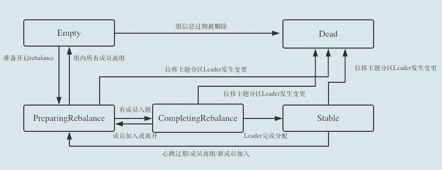
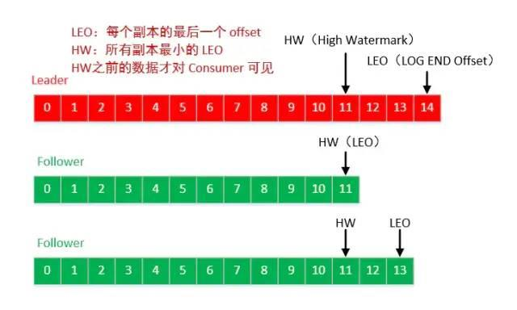

# 再平衡

## 什么情况下会发生再平衡?

* 有新的消费者加入消费组
* 有消费者宕机或下线
    * 消费者并不一定需要真正下线，例如遇到长时间的GC、网络延迟导致消费者长时间未向 GroupCoordinator 发送心跳等情况时，GroupCoordinator 会认为消费者已经下线
    * 有消费者主动退出消费组（发送 LeaveGroupRequest 请求）。比如客户端调用了 unsubscrible() 方法取消对某些主题的订阅
* 消费组所对应的 GroupCoordinator 节点发生了变更，例如coordinator挂了，集群选举出新的coordinator。GroupCoordinator 是 Kafka 服务端中用于管理消费组的组件。而消费者客户端中的 ConsumerCoordinator 组件负责与 GroupCoordinator 进行交互
* 消费组内所订阅的任一主题或者主题的partition数量发生变化

## 再均衡协议

* Heartbeat请求：consumer需要定期给coordinator发送心跳来表明自己还活着
* LeaveGroup请求：主动告诉coordinator我要离开consumer group
* SyncGroup请求：group leader把分配方案告诉组内所有成员
* JoinGroup请求：成员请求加入组
* DescribeGroup请求：显示组的所有信息，包括成员信息，协议名称，分配方案，订阅信息等。通常该请求是给管理员使用

## 再均衡过程

Kafka中分区再均衡主要分为两步，第一步是JoinGroup，第二步是SyncGroup

1. Join， 顾名思义就是加入组。这一步中，所有成员都向coordinator发送JoinGroup请求，请求入组。一旦所有成员都发送了JoinGroup请求，coordinator会从中选择一个consumer担任leader的角色，并把组成员信息以及订阅信息发给leader：注意leader和coordinator不是一个概念。leader负责消费分配方案的制定。

2. Sync，这一步leader开始分配消费方案，即哪个consumer负责消费哪些topic的哪些partition。一旦完成分配，leader会将这个方案封装进SyncGroup请求中发给coordinator，非leader也会发SyncGroup请求，只是内容为空。coordinator接收到分配方案之后会把方案塞进SyncGroup的response中发给各个consumer。这样组内的所有成员就都知道自己应该消费哪些分区了。

## 消费者组状态以及状态转换

* Dead：组内已经没有任何成员的最终状态，组的元数据也已经被coordinator移除了。这种状态响应各种请求都是一个response： UNKNOWN_MEMBER_ID
* Empty：组内无成员，但是位移信息还没有过期。这种状态只能响应JoinGroup请求
* PreparingRebalance：组准备开启新的rebalance，等待成员加入
* AwaitingSync：正在等待leader consumer将分配方案传给各个成员
* Stable：rebalance完成，可以开始消费了



## 再平衡例子和策略？

### Range（默认）

range策略：首先会计算每个consumer可以消费的分区个数，然后按照顺序将指定个数范围的分区分配给各个consumer；这种方式分配只是针对消费者订阅的topic的单个topic所有分区再分配

eg1: 10分区；2个机器实例，一个1个线程，一个2个线程（消费者线程排完序将会是C1-0, C2-0, C2-1）

```java
C1-0 将消费 0, 1, 2, 3 分区
C2-0 将消费 4, 5, 6 分区
C2-1 将消费 7, 8, 9 分区
```

eg2: 11分区 同上，可能是如下

```java
C1-0 将消费 0, 1, 2, 3 分区
C2-0 将消费 4, 5, 6, 7 分区
C2-1 将消费 8, 9, 10 分区
```

eg3: 假如有2个主题(T1和T2)，分别有10个分区，那么最后分区分配的结果看起来如下

```java
C1-0 将消费 T1主题的 0, 1, 2, 3 分区以及 T2主题的 0, 1, 2, 3分区
C2-0 将消费 T1主题的 4, 5, 6 分区以及 T2主题的 4, 5, 6分区
C2-1 将消费 T1主题的 7, 8, 9 分区以及 T2主题的 7, 8, 9分区
```

可以看出，C1-0 消费者线程比其他消费者线程多消费了2个分区，这就是Range strategy的一个很明显的弊端。

### Round Robin

会采用轮询的方式将当前所有的分区依次分配给所有的consumer；这种分配策略是针对消费者消费的所有topic的所有分区进行分配。当有新的消费者加入或者有消费者退出，就会触发rebalance

使用RoundRobin策略有两个前提条件必须满足
* 同一个Consumer Group里面的所有消费者的num.streams必须相等；
* 每个消费者订阅的主题必须相同。

假如按照 hashCode 排序完的topic-partitions组依次为T1-5, T1-3, T1-0, T1-8, T1-2, T1-1, T1-4, T1-7, T1-6, T1-9，消费者线程排序为C1-0, C1-1, C2-0, C2-1，最后分区分配的结果为：

```java
C1-0 将消费 T1-5, T1-2, T1-6 分区；
C1-1 将消费 T1-3, T1-1, T1-9 分区；
C2-0 将消费 T1-0, T1-4 分区；
C2-1 将消费 T1-8, T1-7 分区；
```

### Sticky

```java
sticky 英[ˈstɪki]
美[ˈstɪki]
adj. 黏(性)的; 一面带黏胶的; 闷热的;
n. 告事贴;
```

Sticky策略是新版本中新增的策略，顾名思义，这种策略会保证再分配时已经分配过的分区尽量保证其能够继续由当前正在消费的consumer继续消费，当然，前提是每个consumer所分配的分区数量都大致相同，这样能够保证每个consumer消费压力比较均衡

eg:三个consumer：C0、C1和C2，三个topic：t0、t1和t2，这三个topic分别有1、2和3个分区；C0订阅了t0，C1订阅了t0和t1，C2则订阅了t0、t1和t2

分区排序结果 | 定于的consumer数量 | 订阅的consumer
:---:|:---:|:---:
t2-0 | 1 | c2
t2-1 | 1 | c2
t2-2 | 1 | c2
t1-0 | 2 | c1, c2
t1-1 | 2 | c1, c2
t0-0 | 3 | c0，c2, c2

consumer进行排序:c0,c1,c2；然后将各个分区依次遍历分配给各个consumer，首先需要注意的是，这里的遍历并不是C0分配完了再分配给C1，而是每次分配分区的时候都整个的对所有的consumer从头开始遍历分配，如果当前consumer没有订阅当前分区，则会遍历下一个consumer。

最终分配结果如下

consumer | topic-partition
:---:|:---:
c0 | t0-0
c1 | t1-0, t1-1
c2 | t2-0, t2-1, t2-2

eg2: 假设开始分配如下，然后c1宕机

consumer | topic-partition
:---:|:---:
c0 | t0-0, t1-1, t3-0
c1 | t1-1, t2-0, t3-1
c2 | t1-0, t2-1

然后在平衡后

consumer | topic-partition
:---:|:---:
c0 | t0-0, t1-1, t3-0, t2-0
c2 | t1-0, t2-1, t0-1, t3-1

## GroupCoordinator

Kafka 的 Server 端主要有三块内容：GroupCoordinator、Controller 和 ReplicaManager，其中，GroupCoordinator 的内容是与 Consumer 端紧密结合在一起的，简单来说就是，GroupCoordinator 是负责进行 consumer 的 group 成员的rebalance与 offset 管理。GroupCoordinator 处理的 client 端请求类型可以看出来，它处理的请求类型主要有以下几种：

* ApiKeys.OFFSET_COMMIT;
* ApiKeys.OFFSET_FETCH;
* ApiKeys.JOIN_GROUP;
* ApiKeys.LEAVE_GROUP;
* ApiKeys.SYNC_GROUP;
* ApiKeys.DESCRIBE_GROUPS;
* ApiKeys.LIST_GROUPS;
* ApiKeys.HEARTBEAT;

而 Kafka Server 端要处理的请求总共有21 种，其中有 8 种是由 GroupCoordinator 来完成的。

### 基于zk的rebalance

在kafka0.9版本之前,consumer的rebalance是通过在zookeeper上注册watch完成的。每个consumer创建的时候，会在在Zookeeper上的路径为/consumers/[consumer group]/ids/[consumer id]下将自己的id注册到消费组下；然后在/consumers/[consumer group]/ids 和/brokers/ids下注册watch；最后强制自己在消费组启动rebalance。

这种做法很容易带来zk的羊群效应，任何Broker或者Consumer的增减都会触发所有的Consumer的Rebalance，造成集群内大量的调整；同时由于每个consumer单独通过zookeeper判断Broker和consumer宕机，由于zk的脑裂特性，同一时刻不同consumer通过zk看到的表现可能是不一样，这就可能会造成很多不正确的rebalance尝试；除此之外，由于consumer彼此独立，每个consumer都不知道其他consumer是否rebalance成功，可能会导致consumer group消费不正确。

### Coordinator

对于每一个Consumer Group，Kafka集群为其从broker集群中选择一个broker作为其coordinator。coordinator主要做两件事：

* 维持group的成员组成。这包括加入新的成员，检测成员的存活性，清除不再存活的成员。
* 协调group成员的行为

Coordinator有如下几种类型：

* GroupCoordinator：broker端的，每个kafka server都有一个实例，管理部分的consumer group和它们的offset
* WorkerCoordinator：broker端的，管理GroupCoordinator程序，主要管理workers的分配。
* ConsumerCoordinator：consumer端的，和GroupCoordinator通信的媒介。

ConsumerCoordinator是KafkaConsumer的一个成员，只负责与GroupCoordinator通信，所以真正的协调者还是GroupCoordinator。

对于 ConsumerGroup 而言，是根据其 group.id 进行 hash 并计算得到其具对应的 partition 值，该 partition leader 所在 Broker 即为该 Group 所对应的 GroupCoordinator，GroupCoordinator 会存储与该 group 相关的所有的 Meta 信息

每个分区有Leo, HW, Current Position, Last Committed Offset这些信息




### 消费者与broker建立通信：FIND_COORDINATOR

消费者需要确定它所属的消费组对应的 GroupCoordinator 所在的 broker，并创建与该 broker 相互通信的网络连接。如果消费者已经保存了与消费组对应的 GroupCoordinator 节点的信息，并且与它之间的网络连接是正常的，那么就可以进入第二阶段。否则，就需要向集群中的某个节点发送 FindCoordinatorRequest 请求来查找对应的 GroupCoordinator，这里的“某个节点”并非是集群中的任意节点，而是负载最小的节点。

### 加入GroupCoordinator：JOIN_GROUP

在成功找到消费组所对应的 GroupCoordinator 之后就进入加入消费组的阶段，在此阶段的消费者会向 GroupCoordinator 发送 JoinGroupRequest 请求，并处理响应。

选举消费组的leader
如果消费组内还没有 leader，那么第一个加入消费组的消费者即为消费组的 leader。如果某一时刻 leader 消费者由于某些原因退出了消费组，那么会重新选举一个新的 leader

选举分区分配策略

* 收集各个消费者支持的所有分配策略，组成候选集 candidates
* 每个消费者从候选集 candidates 中找出第一个自身支持的策略，为这个策略投上一票
* 计算候选集中各个策略的选票数，选票数最多的策略即为当前消费组的分配策略

### 同步：SYNC_GROUP

leader 消费者根据在第二阶段中选举出来的分区分配策略来实施具体的分区分配，在此之后需要将分配的方案同步给各个消费者，通过 GroupCoordinator 这个“中间人”来负责转发同步分配方案的。

### 心跳：HEARTBEAT

进入这个阶段之后，消费组中的所有消费者就会处于正常工作状态。在正式消费之前，消费者还需要确定拉取消息的起始位置。假设之前已经将最后的消费位移提交到了 GroupCoordinator，并且 GroupCoordinator 将其保存到了 Kafka 内部的 __consumer_offsets 主题中，此时消费者可以通过 OffsetFetchRequest 请求获取上次提交的消费位移并从此处继续消费。

消费者通过向 GroupCoordinator 发送心跳来维持它们与消费组的从属关系，以及它们对分区的所有权关系。只要消费者以正常的时间间隔发送心跳，就被认为是活跃的，说明它还在读取分区中的消息。心跳线程是一个独立的线程，可以在轮询消息的空档发送心跳。如果消费者停止发送心跳的时间足够长，则整个会话就被判定为过期，GroupCoordinator 也会认为这个消费者已经死亡，就会触发一次再均衡行为。
